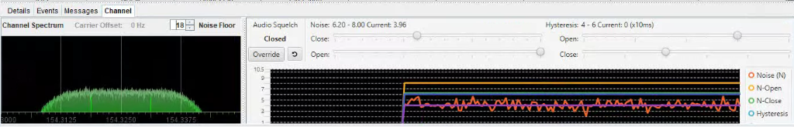
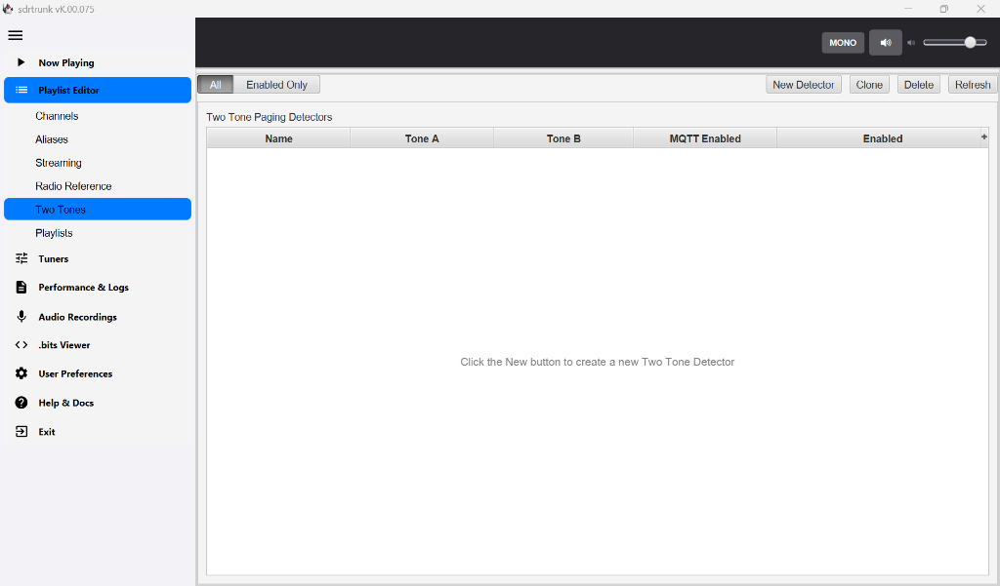
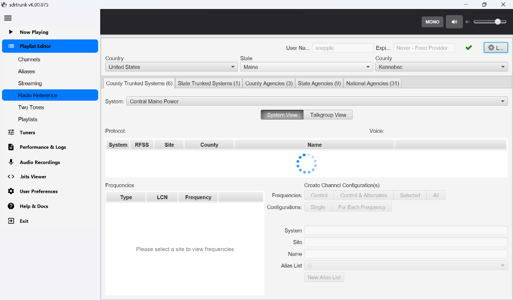
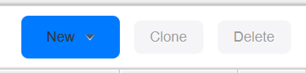

### Latest Compiled Release: [Download K.00.076](https://github.com/snepple/SDRTrunk_Kennebec/releases/tag/K.00.076)
### Latest Compiled Release: [Download K.00.076](https://github.com/snepple/SDRTrunk_Kennebec/releases/tag/K.00.076)

<h1>sdrtrunk - Kennebec Version</h1>

Welcome to <strong>SDRTrunk Kennebec</strong>—a highly customized, feature-rich fork of the original SDRTrunk application. Engineered for robust decoding, monitoring, recording, and streaming of trunked mobile and related radio protocols using Software Defined Radios (SDR).

While the original SDRTrunk provides an excellent decoding engine, the Kennebec build is explicitly designed for the modern public safety listening environment. It layers an extensive suite of new capabilities on top of the original engine to provide a highly refined, context-aware, and automated user experience.

<h2>🌟 Kennebec Highlights</h2>

Kennebec introduces features not found in any other SDR software:

<ul>
  <li><strong>AI-Powered Transcriptions & Optimization:</strong> Real-time radio audio transcription (via OpenAI Whisper / Google Speech-to-Text) and NBFM AI audio noise filtering.</li>
  <li><strong>Advanced Integrations:</strong> Real-time UDP streaming specifically for the IAmResponding platform, plus enhanced OpenMHz and Broadcastify integration.</li>
  <li><strong>Modern UX/UI Redesign:</strong> A beautiful macOS-style aesthetic with a custom collapsible left-hand sidebar, high-DPI SVG icons, and inline table editing.</li>
  <li><strong>Resilience & Health:</strong> Automated tuner self-healing logic, Smart Bandwidth (auto-optimizing sample rate to save CPU), and built-in System Health notifications.</li>
  <li><strong>In-App Documentation:</strong> An embedded, fully searchable knowledge base right inside the application.</li>
</ul>

<h2>What is SDRTrunk?</h2>

SDRTrunk is a Java-based application that transforms a standard computer and compatible Software Defined Radio hardware, such as RTL-SDR, Airspy, or HackRF, into a powerful, multi-channel radio scanner. Unlike traditional hardware scanners that can only listen to one frequency at a time, SDRTrunk captures a wide swath of the radio spectrum simultaneously.

This wideband capture allows the software to monitor entire trunked radio systems, where conversations dynamically jump across multiple frequencies. SDRTrunk automatically tracks system control channels, decodes the digital or analog voice traffic, and pieces the conversations back together in real time. It supports a variety of common public safety and commercial radio protocols, including Project 25 (P25) Phase 1 and 2, DMR, LTR, and standard analog FM. By utilizing software-based digital signal processing, it provides an accessible and highly configurable way to monitor local radio traffic, manage talkgroups, and route the resulting audio to external internet streaming platforms.

<h2>How does trunking radios work?</h2>

For those not familiar, trunking systems allow a large number of user groups to share a limited number of radio frequencies by temporarily, dynamically assigning radio frequencies to talkgroups (channels) on-demand. It is understood that most user groups actually use the radio very sporadically and don't need a dedicated frequency.

Most trunking system types (such as SmartNet and P25) set aside one of the radio frequencies as a "control channel" that manages and broadcasts radio frequency assignments. When someone presses the Push to Talk button on their radio, the radio sends a message to the system which then assigns a voice frequency and broadcasts a Channel Grant message about it on the control channel. This lets the radio know what frequency to transmit on and tells other radios set to the same talkgroup to listen.

In order to follow all of the transmissions, SDRTrunk Kennebec constantly listens to and decodes the control channel. When a frequency is granted to a talkgroup, SDRTrunk Kennebec creates a monitoring process which decodes the portion of the radio spectrum for that frequency from the SDR that is already pulling it in.

No message is transmitted on the control channel when a conversation on a talkgroup is over. The monitoring process keeps track of transmissions and if there has been no activity for a specified period, it ends the recording.

<h2>What the Kennebec Version Adds (Versus the Source Fork)</h2>

The Kennebec version builds on the upstream sdrtrunk codebase with a focused set of improvements for operators who need reliable, unattended streaming and monitoring.

<h3>Modernized Interface and Workflow</h3>
<ul>
  <li>Refreshed GUI with updated icons and an improved Now Playing view</li>
  <li>Consolidated settings in a single user preference area, eliminating the need to hunt across multiple menus</li>
  <li>New interface for reviewing logs and browsing recorded audio files</li>
  <li>Ability to set allocated memory directly via the user preferences Ux/GUI</li>
  <li>AI Integration for Audio Monitoring and System Health Notifications</li>
  <li>Automated Geographic ID generation for NBFM channels</li>
</ul>

<h3>In-App Knowledge Base</h3>
<ul>
  <li>An embedded, searchable help viewer brings documentation directly into the application. You no longer need to switch to a browser to look up configuration details or protocol explanations.</li>
  <li>Contextual DSP explanations and interactive configuration.</li>
</ul>

<h3>Streaming and Audio Reliability</h3>
<ul>
  <li>Automated audio recording, streaming, and metadata tagging</li>
  <li>SDR tuner width auto-calculation to reduce manual configuration</li>
  <li>New stream type for IamResponding (local UDP) using Two Tone Detect</li>
  <li>Tuner self-healing logic that automatically attempts to recover from hardware errors</li>
  <li>Automated tuner reset on Windows 10 and higher using PowerShell scripts for hard-reset of locked or failed SDR devices</li>
</ul>

<h3>Monitoring and Alerts</h3>
<ul>
  <li>Two Tone Detect functionality for paging and dispatch monitoring</li>
  <li>Inactivity monitoring: alerts via Telegram or Email when a channel remains silent for a configurable duration</li>
  <li>Configurable error notifications via Telegram or Email for application or tuner faults</li>
</ul>

<h3>Optional AI Integration</h3>
<ul>
  <li>When enabled, Gemini AI can automatically set channel filters, review logs, monitor application performance, assess audio quality, and notify you if a channel becomes unintelligible.</li>
</ul>

<h3>OS and Java Integration</h3>
<ul>
  <li>Deep OS integration via modern Java and JNA provides native backdrop effects, theme syncing with the system appearance, and DPI-aware rendering on Windows.</li>
</ul>

<h2>Core SDRTrunk Features</h2>
<ul>
  <li>Comprehensive digital and analog trunking support (P25 Phase 1 & 2, DMR, LTR, etc.)</li>
  <li>Multi-channel tracking from a wideband capture</li>
  <li>Automated control channel following and voice traffic decoding</li>
  <li>Manage talkgroups and route audio to various streaming platforms</li>
</ul>

<h2>Installing via Native Installer</h2>

If you prefer an easy-to-use application installer (such as a <code>.exe</code> installer for Windows) instead of extracting a ZIP file and running the <code>sdr-trunk.bat</code> script, you can easily generate one! The build system natively supports the JDK's <code>jpackage</code> utility.

Simply run the following command from the source code root directory (using the Gradle wrapper):

<pre><code>./gradlew createInstaller -x compileJni</code></pre>

This will bundle the compiled Java application, dependencies, and native Java runtime into a standard OS installer package in the <code>build/installer/</code> directory.

<h2>📚 Documentation & Guides</h2>

<strong><a href="https://sam-64221fcd.mintlify.app/">Read the official SDRTrunk Kennebec Documentation</a></strong>

For detailed information, setup guides, tutorials, and troubleshooting, please visit our comprehensive documentation portal. The portal covers everything from initial hardware setup to advanced streaming and AI integration.

<h2>📸 Updated Screenshots</h2>

Refreshed macOS-style GUI & Side Navigation 

  

Streamlined Aliases & Inline Editing 

  

Enhanced Channel Layouts & Graphs 

  

Streaming Integrations (IAmResponding & more) 

<h2>Historical Screenshots</h2>

Refreshed GUI (Now Playing) 

  

In-App Knowledge Base &amp; Help Viewer 

  

Two Tone Detect Functionality 

  

Audio Recordings Review 

  

Consolidated User Preferences 

<h2>Minimum System Requirements</h2>
<ul>
  <li>Operating System: Windows (64-bit), Linux (64-bit) or Mac (64-bit, 12.x or higher)</li>
  <li>CPU: 4-core</li>
  <li>RAM: 8GB or more (preferred). Depending on usage, 4GB may be sufficient.</li>
  <li>Java: Requires Java 23+ (automatically provisioned via Gradle Toolchains).</li>
</ul>
