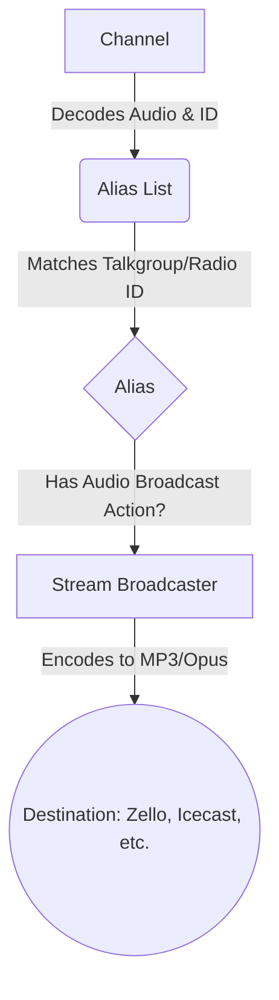

Let's see what topic to cover. The user instructions say:
"Your mission is to create ONE new 'How-To' guide or update an existing documentation page in the application's help section every day."

Looking at `.Jules/scribe.md`, we see that the following guides have been added already:
- Zello
- ThinLine Radio
- Rdio Scanner
- Virtual Audio Cable
- OpenMHz
- Radio Reference Import
- Ignore Unwanted Talkgroups
- P25 Talkgroup Override (updated p25.md)
- Spectrum & Waterfall Display
- Aliases and Talkgroups Diagram

What is missing? In `HelpViewController.java` we have:
```java
        TreeItem<String> integrationsStreamingNode = new TreeItem<>("Integrations & Streaming");
        integrationsStreamingNode.getChildren().add(new TreeItem<>("Broadcastify"));
        integrationsStreamingNode.getChildren().add(new TreeItem<>("Mqtt"));
        integrationsStreamingNode.getChildren().add(new TreeItem<>("Openmhz"));
        integrationsStreamingNode.getChildren().add(new TreeItem<>("Other Platforms"));
        integrationsStreamingNode.getChildren().add(new TreeItem<>("Rdio Scanner"));
        integrationsStreamingNode.getChildren().add(new TreeItem<>("Thinline Radio"));
        integrationsStreamingNode.getChildren().add(new TreeItem<>("Two Tone Detect"));
        integrationsStreamingNode.getChildren().add(new TreeItem<>("Zello"));
```

Wait, `Mqtt` is in the list, and `mqtt.md` exists. `Broadcastify` exists. `Two Tone Detect` exists.

What about `Advanced & System`?
```java
        TreeItem<String> advancedSystemNode = new TreeItem<>("Advanced & System");
        advancedSystemNode.getChildren().add(new TreeItem<>("Audio Recordings"));
        advancedSystemNode.getChildren().add(new TreeItem<>("Diagnostics"));
        advancedSystemNode.getChildren().add(new TreeItem<>("Gemini Ai"));
        advancedSystemNode.getChildren().add(new TreeItem<>("Ignore Unwanted Talkgroups"));
        advancedSystemNode.getChildren().add(new TreeItem<>("Inactivity Monitoring"));
        advancedSystemNode.getChildren().add(new TreeItem<>("Notifications"));
        advancedSystemNode.getChildren().add(new TreeItem<>("System Requirements"));
        advancedSystemNode.getChildren().add(new TreeItem<>("User Preferences"));
        advancedSystemNode.getChildren().add(new TreeItem<>("Virtual Audio Cable"));
```
`Audio Recordings` (audio-recordings.md)
`Diagnostics` (diagnostics.md)
`Gemini Ai` (gemini-ai.md)
`Ignore Unwanted Talkgroups` (ignore-unwanted-talkgroups.md)
`Inactivity Monitoring` (inactivity-monitoring.md)
`Notifications` (notifications.md)
`System Requirements` (system-requirements.md)
`User Preferences` (user-preferences.md)

What about `Organization & Playlists`?
```java
        TreeItem<String> organizationPlaylistsNode = new TreeItem<>("Organization & Playlists");
        organizationPlaylistsNode.getChildren().add(new TreeItem<>("Aliases Talkgroups"));
        organizationPlaylistsNode.getChildren().add(new TreeItem<>("Playlist Editor"));
        organizationPlaylistsNode.getChildren().add(new TreeItem<>("Radio Reference"));
```
`Aliases Talkgroups` (aliases-talkgroups.md)
`Playlist Editor` (playlist-editor.md)
`Radio Reference` (radio-reference.md)

What about `Channels & Decoding`?
```java
        TreeItem<String> channelsDecodingNode = new TreeItem<>("Channels & Decoding");
        channelsDecodingNode.getChildren().add(new TreeItem<>("Analog"));
        channelsDecodingNode.getChildren().add(new TreeItem<>("Dmr"));
        channelsDecodingNode.getChildren().add(new TreeItem<>("P25"));
```

Are there any complex logic interactions missing a guide or a flowchart?
"Look for complex logic (e.g., the interaction between Channels, Aliases, and Streaming) that needs a flowchart."

Let's check `channels-&-decoding.md`, `integrations-&-streaming.md`, etc.
There is a file called `integrations-&-streaming.md` but its content is just:
```markdown
Find out how to stream audio and integrate SDRTrunk with external platforms.
```

Let's look at the instruction:
"Look for complex logic (e.g., the interaction between Channels, Aliases, and Streaming) that needs a flowchart."
Wait! "the interaction between Channels, Aliases, and Streaming".
Let's make a new page: `channels-aliases-streaming.md` with a Mermaid flowchart explaining how a Channel receives audio, decodes a Talkgroup ID, matches it in an Alias list, and then routes it to a Streaming endpoint!

Let's check if this is a good topic.
"Pick a topic that ranges from 'Basic Navigation' to 'System Logic Interconnectivity'."
This fits perfectly with "System Logic Interconnectivity".

Page Name: `channels-aliases-streaming.md`
Title: "How Channels, Aliases, and Streaming Interconnect"

Goal: To understand the signal flow from RF Reception to Audio Streaming.
Mermaid Flowchart:


Steps:
1. Channel decodes the RF signal and extracts audio along with an identifier (Talkgroup or Radio ID).
2. The Channel refers to its assigned Alias List.
3. If an Alias matches the identifier, SDRTrunk looks at the actions configured for that Alias.
4. If an "Audio Broadcast" action is present, the audio is routed to the corresponding Stream Broadcaster.
5. The Stream Broadcaster encodes the audio and delivers it to the platform (e.g., Zello, Broadcastify).

Then we need to add this to `HelpViewController.java`. Under which node? `Guides & Documentation` -> `Organization & Playlists` or `Integrations & Streaming`? Probably `Integrations & Streaming` or `Getting Started`? Or create a new node?
Let's add it to `Integrations & Streaming` as `Channels Aliases Streaming`.
In `HelpViewController.java`:
```java
        integrationsStreamingNode.getChildren().add(new TreeItem<>("Channels Aliases Streaming"));
```
Wait, if it's named `Channels Aliases Streaming`, the logic converts to `channels-aliases-streaming.md` automatically as per memory:
"In SDRTrunk's `HelpViewController.java`, documentation markdown files are loaded dynamically based on the `TreeItem` node name. The system converts the node name to lowercase and replaces spaces with hyphens (e.g., adding a node named 'Channels Aliases Streaming' automatically maps to `channels-aliases-streaming.md`)."

Let me add it under `Guides & Documentation` -> `Getting Started` or maybe just a new node. Let's look at `HelpViewController.java`.

```java
        TreeItem<String> advancedSystemNode = new TreeItem<>("Advanced & System");
```

Let's review the current nodes in `HelpViewController.java` to see the best place:
```java
        TreeItem<String> organizationPlaylistsNode = new TreeItem<>("Organization & Playlists");
        organizationPlaylistsNode.getChildren().add(new TreeItem<>("Aliases Talkgroups"));
        organizationPlaylistsNode.getChildren().add(new TreeItem<>("Playlist Editor"));
        organizationPlaylistsNode.getChildren().add(new TreeItem<>("Radio Reference"));
        guidesNode.getChildren().add(organizationPlaylistsNode);
```
Maybe add `Channels Aliases Streaming` under `Integrations & Streaming`.
```java
        TreeItem<String> integrationsStreamingNode = new TreeItem<>("Integrations & Streaming");
        integrationsStreamingNode.getChildren().add(new TreeItem<>("Broadcastify"));
        integrationsStreamingNode.getChildren().add(new TreeItem<>("Channels Aliases Streaming"));
...
```

I will add it there.

Wait, is there any other thing I need to do?
- Write modular Markdown using Mintlify style (callouts, structured lists).
- Include visual representations (Mermaid, Markdown tables) for processes.
- Progressive Disclosure: Start with the "Quick Start" or "Direct Goal," then move into "Advanced Configuration."
- Component Maps: Use lists to define what every button in a specific panel does.
- Check existing documentation to ensure I'm not duplicating.
- Keep guides focused on a single task.
- Update .Jules/scribe.md with a critical insight log entry.
- Version bump in gradle.properties as a critical final step.

Let's refine the plan.
