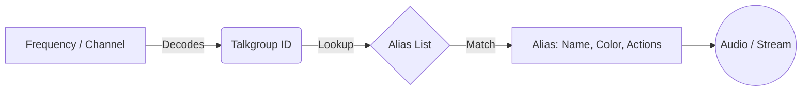

# Organize talkgroups and radio IDs with aliases

Aliases let you replace raw numeric talkgroup and radio IDs with meaningful names, colors, and automated actions. Instead of seeing `47001` scroll past in the **Now Playing** panel, you see `Fire Station 3 Dispatch` highlighted in red. Aliases are stored in named alias lists, and each channel configuration points to one alias list to resolve the IDs it decodes.

## What is an alias list?

An alias list is a named collection of aliases scoped to a single playlist. You create at least one alias list and assign it to one or more channels in the **Playlist Editor**. When SDRTrunk Kennebec decodes activity on a channel, it looks up the talkgroup or radio ID in the assigned alias list to find the matching alias name, color, icon, and actions.

You can create multiple alias lists — for example, one per agency or region — and assign the appropriate list to each channel.

### Relationship: Channels, Talkgroups, and Aliases

## Open the Alias Editor

In the **Playlist Editor**, click **Aliases** in the left sidebar. The Alias Editor opens with three view modes selectable from the top toolbar:

- **Alias** — create and manage aliases directly.
- **Identifier** — browse aliases sorted by their assigned identifiers.
- **Record** — view aliases that have a recording action configured.

## Create an alias list

  **1. Open the Alias Editor**

    Click **Aliases** in the **Playlist Editor** sidebar.

  **2. Add a new alias list**

    Click **New List** or type a new list name in the alias list dropdown. Alias list names must be unique within a playlist.

  **3. Select the list**

    Choose your new list from the dropdown. All aliases you create from this point are added to the selected list.

## Map a talkgroup ID to a name

  **4. Select the target alias list**

    Use the alias list dropdown at the top of the Alias Editor to choose the list you want to add to.

  **5. Create a new alias**

    Click **New** in the alias table toolbar. A blank alias row appears.

  **6. Set the alias name**

    In the **Name** field of the detail editor, type the display name for this talkgroup — for example, `Engine 7` or `PD Dispatch`.

  **7. Add a talkgroup identifier**

    Click **Add ID** and select **Talkgroup** from the identifier type menu. Enter the numeric talkgroup ID. For systems that use a range, select **Talkgroup Range** and enter the start and end values.

  **8. Set a color (optional)**

    Click the color swatch to open the color picker and assign a highlight color. This color appears in the **Now Playing** panel when this alias is active.

  **9. Save**

    Click **Save**. The alias row in the table updates with the name and identifier summary.

## Map a radio ID to a name

The process is identical to mapping a talkgroup — select **Radio ID** (or **Radio ID Range**) as the identifier type instead. Radio IDs identify individual subscriber units transmitting on a channel.

> **Note**
>
P25 systems may use **P25 Fully Qualified Radio ID** or **P25 Fully Qualified Talkgroup** identifiers for cross-system calls. Select the appropriate identifier type when monitoring P25 Phase 2 or DFSI systems.

## Supported identifier types

Each alias can have one or more identifiers attached to it. SDRTrunk Kennebec matches an alias when any of its identifiers match the decoded activity.

| Identifier type | Description |
| --- | --- |
| **Talkgroup** | Matches a single talkgroup ID. |
| **Talkgroup Range** | Matches a contiguous block of talkgroup IDs. Useful for fleet groupings. |
| **Radio ID** | Matches a single subscriber unit (radio) ID. |
| **Radio ID Range** | Matches a contiguous block of radio IDs. |
| **P25 Fully Qualified Radio ID** | P25 cross-system radio ID that includes WACN/System ID plus radio ID. |
| **P25 Fully Qualified Talkgroup** | P25 cross-system talkgroup ID that includes WACN/System ID plus talkgroup ID. |
| **Audio Broadcast Channel** | Routes audio for this alias to a named streaming output. |
| **Audio Priority** | Sets playback priority (lower number = higher priority) when multiple talkgroups are active simultaneously. |
| **Record** | Marks audio for local WAV or MP3 recording to the configured recordings directory. |
| **Two Tone Paging** | Links this alias to a Two Tone detector configuration by name. |
| **CTCSS / DCS** | Matches calls that include a specific CTCSS or DCS code on a shared conventional channel. |
| **User Status / Unit Status** | Matches P25 status update messages from subscriber units. |

## Alias actions

In addition to a name and color, each alias can trigger one or more automated actions when a matching call is decoded.

  **Beep**

    Plays a short audible beep through the system speaker when a call matching this alias begins. Use this as a heads-up alert for high-priority talkgroups.

    To add a beep action: click **Add Action** in the alias detail editor and select **Beep**.

  **Play Clip**

    Plays a custom audio file (WAV or MP3) when a call matching this alias begins. You specify the path to the clip file in the action editor.

    To add a clip action: click **Add Action**, select **Play Clip**, then browse to the audio file.

  **Run Script**

    Executes an external script or command when a call matching this alias begins. The script receives call metadata as arguments, enabling integrations such as home automation triggers or custom logging.

    To add a script action: click **Add Action**, select **Run Script**, then enter the full path to the script.

    > **Warning**
>
    The **Run Script** action executes with the same OS privileges as SDRTrunk Kennebec. Only point it at scripts you control and trust.

## Alias groups and icons

Assign each alias an optional **Group** tag to categorize aliases within a list — for example, `Fire` or `Law Enforcement`. The group tag is a free-text string used for visual filtering in the Alias Editor.

You can also assign an **Icon** to each alias. SDRTrunk Kennebec displays the icon alongside the alias name in the **Now Playing** panel. Manage icons through **View → Icon Manager** in the **Playlist Editor**.

## Additional alias properties

| Property | Description |
| --- | --- |
| **Audio output device** | Route audio for this alias to a specific output device, overriding the global audio output setting. |
| **Stream as talkgroup** | When streaming, substitute a different talkgroup value in the metadata sent to the stream server. |

## Import talkgroup names from RadioReference

If you have a RadioReference.com Premium subscription, you can import talkgroup names and IDs directly into the active playlist's alias list rather than entering them one by one.

  **10. Open the Radio Reference section**

    Click **Radio Reference** in the **Playlist Editor** sidebar.

  **11. Log in**

    Enter your RadioReference.com username and password and click **Login**.

  **12. Browse to your system**

    Navigate to your state, county, and target radio system.

  **13. Import**

    Select the talkgroups you want and click **Import**. SDRTrunk Kennebec creates alias entries in the active playlist automatically, using the RadioReference display names.
