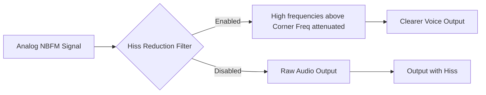

## Goal
Improve analog NBFM audio clarity by removing high-pitched background noise and harsh static using built-in filters.

## What is Analog Hiss Reduction?

SDRTrunk provides a specialized audio filter to reduce the background hiss commonly heard on weak analog FM transmissions. Unlike a simple volume cut, this uses a high-shelf cut filter that attenuates harsh high frequencies while preserving the clarity of voice audio.

## Component Map: NBFM Hiss Reduction Controls

*   **Enable Toggle**: Turns the high-shelf cut filter on or off.
*   **Cut Amount (dB) Slider**: Sets the intensity of the hiss reduction.
    *   *0 dB*: Filter is effectively off.
    *   *-12 dB*: Maximum reduction of high frequencies.
    *   *Tip*: A setting of -6 dB usually provides a good balance between reducing hiss and preserving voice clarity.
*   **Corner Freq (Hz) Slider**: Sets the pivot frequency where the attenuation begins.
    *   *Range*: 1000 Hz to 3500 Hz.
    *   *Tip*: Lowering this value (e.g., to 1500 Hz) will cut more hiss but may make the voice sound slightly duller or muffled. The default is 2000 Hz.

## Quick Start

1. Open the **Playlist Editor**.
2. Select an **NBFM (Analog) Channel**.
3. Scroll down to the **Audio** configuration pane.
4. Expand the **Advanced** section to reveal additional audio controls.
5. Toggle **Enable** under Hiss Reduction to `On`.
6. Adjust the **Cut Amount** and **Corner Freq** sliders while listening to an active transmission to find the optimal balance for your ears.
