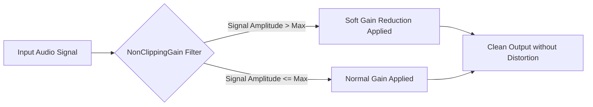

## Goal
Prevent audio distortion caused by loud transmissions exceeding maximum digital audio levels.

## What is Anti-Clipping?

Clipping occurs when the amplitude of an audio signal exceeds the maximum limit that the system can represent, resulting in a harsh, distorted, and "squared-off" sound. SDRTrunk utilizes a `NonClippingGain` audio filter tuned by default to automatically manage audio levels and prevent loud transmissions from distorting.

## How it Works

The anti-clipping filter acts as a safety limiter on the final audio output stage. It monitors the audio stream and dynamically reduces the gain if the signal approaches the digital clipping point (typically set slightly below 1.0 or 0 dBFS).

*   **Automatic Protection**: This feature is built-in and active by default on various decoders (such as P25, NXDN, and NBFM AI Optimizer output).
*   **Smooth Limiting**: Instead of hard-clipping the audio, which sounds terrible, it smoothly trims the audio peaks, ensuring the transmission remains intelligible and pleasant to listen to.
