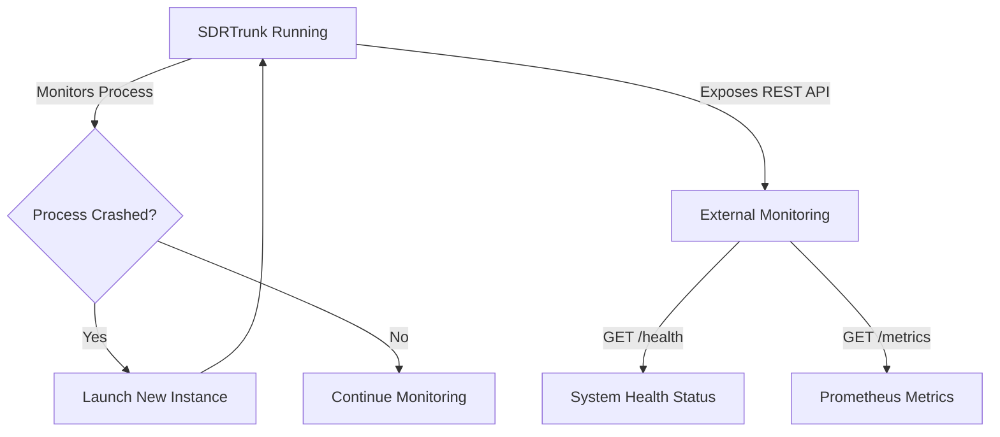

# Application Watchdog

## Goal
To configure the Application Watchdog for automatic crash recovery and understand how to integrate its REST API endpoints with external system monitoring tools like Prometheus and Grafana.

The **Application Watchdog** monitors SDRTrunk and restarts it if it crashes or is closed unexpectedly.

In addition to local restart capabilities, the Watchdog exposes a local REST API for integration with external monitoring systems like Prometheus, Grafana, and uptime-kuma.

## Quick Start: Enabling the Watchdog

The Watchdog is designed to operate silently in the background.

1. Open the **View** menu and select **User Preferences**.
2. In the left sidebar, click **Application**.
3. Toggle the **Automatically restart SDRTrunk if it closes unexpectedly** switch to **ON**.

When enabled, a background service monitors the application process.

## Visual Flow: How the Watchdog Works

## Advanced Configuration: REST API & External Monitoring

For advanced users and server deployments, the Watchdog exposes a local HTTP server that provides health checks and Prometheus-compatible metrics.

### API Endpoints

| Endpoint | Method | Description |
| :--- | :--- | :--- |
| `/health` | `GET` | Aggregates real application state: per-tuner status, channel processing count, and per-stream broadcast state. Reports 503 when any tuner is in an error/recovering state or any configured stream is in an error state. Otherwise, it returns 200 OK. |
| `/metrics` | `GET` | Prometheus text exposition format metrics for external monitoring/dashboards. Exposes per-tuner status, channel processing count, and per-stream state and throughput counters. |
