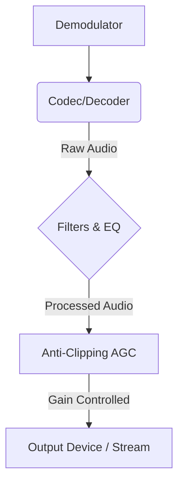

# Audio Quality & Tuning

SDRTrunk Kennebec introduces several new audio processing features designed to improve the listening experience, whether you are monitoring analog repeaters or complex digital trunked systems. This guide covers how these audio enhancements fit into the signal flow and how you can configure them for optimal clarity.

## Audio Processing Pipeline

Decoded audio from a channel passes through multiple filtering and processing stages before reaching your speakers or streaming destination.

## Anti-Clipping

A common issue when monitoring multiple agencies on a digital system is that some radios transmit significantly louder than others, causing distorted, clipped audio when played back through standard speakers.

SDRTrunk Kennebec includes a default **Anti-Clipping** gain control stage in the audio pipeline.
This dynamic Automatic Gain Control (AGC) normalizes audio to a safe listening volume (targeting a -3dB peak). It attenuates overly loud signals before they can clip and distort your speakers, while slightly boosting very quiet transmissions.

No manual configuration is required for Anti-Clipping—it is enabled by default across all channel types to protect your audio output.

## Analog Hiss Reduction

For Narrowband FM (NBFM) and AM channels, background noise and "hiss" can cause listener fatigue during long monitoring sessions. SDRTrunk Kennebec features a configurable post-demodulation filter chain to tackle this:

- **Hiss Reduction:** A high-shelf filter that attenuates high-frequency noise. You can lower the corner frequency if the filter cuts too much into speech, or increase the cut on marginal signals.
- **Low-pass filter:** Rolls off audio above a cutoff frequency (default 2,800 Hz) to eliminate high-frequency static.
- **Noise gate:** Attenuates audio when the signal level drops below a threshold, significantly reducing noise between transmissions.

These settings are configured on a per-channel basis. See the [Analog Channels](/channels-&-decoding/analog) guide for details on tuning these filters in the Playlist Editor.

## P25 Audio Enhancements

Digital P25 audio can sometimes suffer from robotic artifacts, especially on systems using Linear Simulcast (LSM) or when receiving weak signals. The P25 decoder in Kennebec includes specialized audio tuning designed to handle complex Phase 1 and Phase 2 signals.

- **JMBE Integration:** SDRTrunk relies on the external JMBE library to decode AMBE+2 and IMBE voice frames. Ensuring you have the latest version of JMBE built and installed is critical for the best audio quality.
- **Graphic EQ:** The P25 decoder configuration in the Playlist Editor offers a 5-band graphic equalizer. If audio sounds "thin" or lacks clarity on a heavily loaded site, try enabling the Graphic EQ and adjusting the bands to compensate for vocoder compression.

## Advanced Routing

If you need further processing outside of SDRTrunk (such as running audio through a dedicated transcription service or external noise reduction software), you can route specific talkgroups or radios directly to virtual audio devices.

See the [Virtual Audio Cable](/advanced-&-system/virtual-audio-cable) guide for instructions on assigning individual aliases to third-party VAC drivers.
