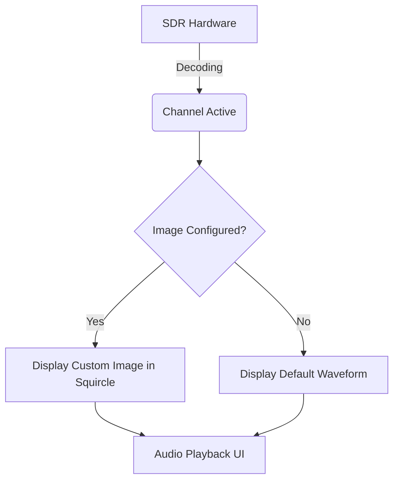

# Assigning Custom Images to Channels

## Goal
Personalize your dispatch layout by assigning custom images (logos, badges, or agency crests) to channels to act as visual identifiers during playback.

## Visual Flow

## Step-by-Step Configuration

  **1. Open the Playlist Editor**

    Navigate to **View → Playlist Editor** from the main menu, and click on **Channels** in the left sidebar to see your configured channels.

  **2. Edit the channel**

    Select the channel you want to customize. In the lower configuration pane, look for the **Channel Image** row.

  **3. Upload a new image**

    Click the **Choose Image...** button to open the file browser.

    > **Tip**
>
    The upload dialog accepts common image formats (PNG, JPG, BMP). High-resolution source images will be automatically optimized and scaled down to 128x128 pixels to preserve system memory without losing visual fidelity.

  **4. Resolution Safety Check**

    If your selected image is smaller than `64x64` pixels, SDRTrunk will reject it with an error dialog. Choose a higher resolution image to ensure the graphic remains crisp when displayed in the UI.

  **5. Verify and Save**

    Once an image is selected, a preview will appear next to the button. Click **Save** in the top toolbar to apply the new image to the channel.

---

## Remove an image

  **1. Locate the channel**

    Select the customized channel in the Playlist Editor.

  **2. Clear the graphic**

    In the Channel Image row, click the **Clear** button next to the preview.

  **3. Save**

    Click **Save** to confirm. The channel will revert to displaying the default waveform gradient when active.
