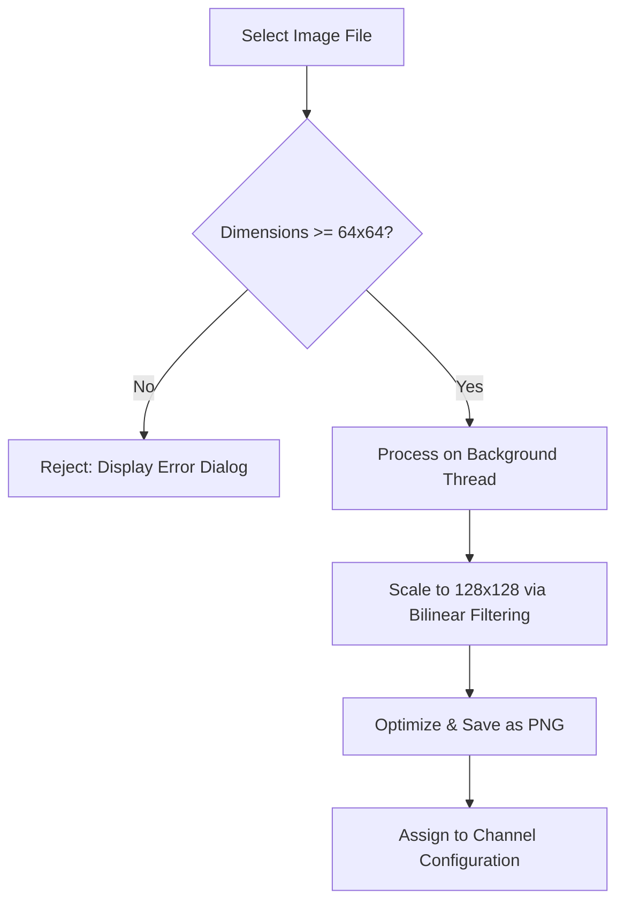

## Goal
Upload custom artwork, logos, or badges to individual channels to customize your SDRTrunk experience. High-resolution images are automatically optimized for display.

# Channel Images

SDRTrunk Kennebec introduces a professional image upload pipeline, allowing you to associate custom artwork (like department logos or dispatcher photos) with any active channel.

## Upload Pipeline

The upload process includes smart validation and automatic optimization.

## UI Component Map

| Component | Function |
| --- | --- |
| **Image Preview Squirle** | Displays the currently assigned artwork. If idle, it shows a default waveform. |
| **Upload Button** | Opens the file chooser dialogue to select a new `.jpg` or `.png` file. |
| **Clear Button** | Removes the currently assigned image and reverts to the default placeholder. |

## How to Assign an Image

1. Open the **Playlist Editor**.
2. Select **Channels** from the left-hand navigation sidebar.
3. Select the channel you wish to edit from the channel table.
4. In the detailed channel editor pane below, locate the **Artwork** section.
5. Click the **Upload** button.
6. Select an image file (must be at least 64x64 pixels).
7. The image will be processed, optimized, and attached to your channel. It will now appear in the sticky top playback bar whenever the channel is active.
