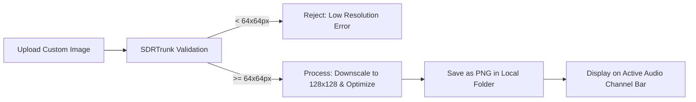

## Goal
Learn how to set up, format, and assign custom image artwork to your channels for a personalized dispatch experience.

## Visual Flow


## Overview
The Channel Image & Custom Artwork Pipeline allows you to upload custom graphics, such as dispatcher photos or agency badges, to visually identify active channels during playback.

## Component Map
*   **Choose Image…**: Prompts you to select a local image file.
*   **Preview Area**: Displays how the image will look once processed into a circular squircle format.
*   **Clear Button**: Removes the custom artwork and resets the channel to its default appearance.
*   **Active Channel Bar**: Sticky playback bar that shows the artwork dynamically when the channel is decoding.

## Step-by-Step Setup
1.  Open the **Playlist Editor** tab and select the channel you wish to edit to load it into the **Channel Configuration Editor**.
2.  In the configuration card, locate the Image section.
3.  Click the **Choose Image…** button.
4.  Select a high-quality image from your computer (*.png, *.jpg, *.jpeg, *.gif, *.bmp).
    *   *Note: Ensure the image is at least 64x64 pixels. Images will be automatically scaled and optimized into 128x128 PNGs.*
5.  Click **Save**.

## User Interface Wireframe
```text
+-------------------------------------------------+
| [O] Active Channel: Police Disp  [||] [Mute]    | <- Sticky Top Bar with Image Squircle
+-------------------------------------------------+
| Channel Configuration                           |
| Name: Police Disp                               |
|                                                 |
| [Img Preview]  [Choose Image…]  [Clear]         |
+-------------------------------------------------+
```
