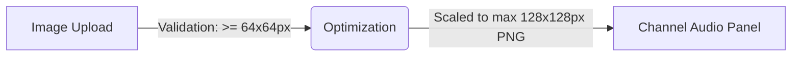

# Channel Images & Custom Artwork

SDRTrunk Kennebec lets you personalize your listening experience by assigning custom artwork to individual channels. You can upload agency logos, emblem badges, dispatcher photos, or custom icons to visually distinguish active channels in the interface.

## How Custom Artwork Works

When a channel is assigned an image, SDRTrunk uses it in two primary places:

1.  **Playlist Editor**: The custom image is displayed in the channel's configuration card.
2.  **Dynamic Playback Bar**: When a channel is actively decoding audio, its assigned artwork is displayed next to the channel in the audio playback panel.

## Uploading a Channel Image

**1. Open the Channel Editor**

In the **Playlist Editor**, click on the specific channel you want to configure to open its settings.

**2. Locate the Image Uploader**

Find the **Choose Image…** dropdown menu in the channel's configuration panel.

**3. Select an Image**

Click **Upload Image...** and select an image file from your computer (`.png`, `.jpg`, `.jpeg`, `.gif`, `.bmp`).

> [!WARNING]
> **Resolution Safety Check**
> To ensure your artwork looks sharp and professional, SDRTrunk requires all uploaded images to be at least **64x64 pixels**. If you attempt to upload an image smaller than this, the application will reject it with a helpful error message.

**4. Automatic Optimization**

Once you select a valid image, SDRTrunk automatically processes it. The image is scaled to a standard **128x128 pixels** and saved locally as a clean PNG.

**5. Clear an Image**

If you want to remove a custom image and return to the default icons, click the **Clear** button next to the image preview.

## Assigning an Icon

If you prefer not to upload custom artwork, you can still choose from the built-in SDRTrunk icon library.

1.  Click the **Choose Image…** dropdown menu.
2.  Select **Choose Icon...**.
3.  Browse the icon library and select the one that best represents the channel.
