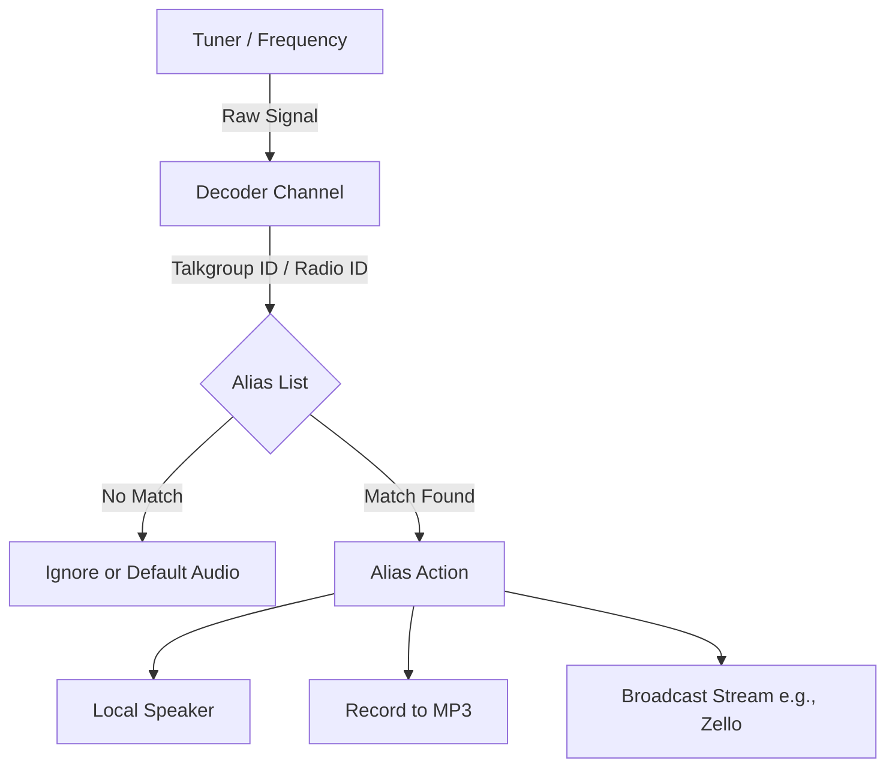

# Goal

Understand how SDRTrunk Kennebec routes audio from a raw radio frequency through the decoder, identifies the caller via aliases, and streams the final audio to destinations like Zello or Broadcastify.

# Visual Flow

# The Editor Panel Interface

Here is a visual representation of how the Playlist Editor is laid out when configuring this logic.

| Left Sidebar (Navigation) | Main Content Area (Configuration) |
|---------------------------|----------------------------------|
| Playlists                 | **Channel Details:**             |
| Channels                  | - Frequency: 154.280 MHz         |
| Aliases                   | - Decoder: NBFM                  |
| Streaming                 | - Alias List: "County Fire"      |
| Radio Reference           |                                  |
| Two Tones                 | **Alias Details:**               |
|                           | - Identifier: 1234               |
|                           | - Action: Stream to "Zello"      |

# Step-by-Step

1. **Configure the Channel**
   Navigate to the **Channels** section in the Playlist Editor. Set your frequency and decoder protocol.
2. **Assign an Alias List**
   In the channel settings, select an Alias List to associate with this channel. This tells SDRTrunk where to look up IDs.
3. **Create the Alias**
   Navigate to the **Aliases** section. Add a new alias with an identifier (e.g., Talkgroup ID) that matches the traffic you want to route.
4. **Link the Stream**
   In the alias settings, add an action for **Audio Broadcast Channel** and select your configured stream (like Zello or Broadcastify).
