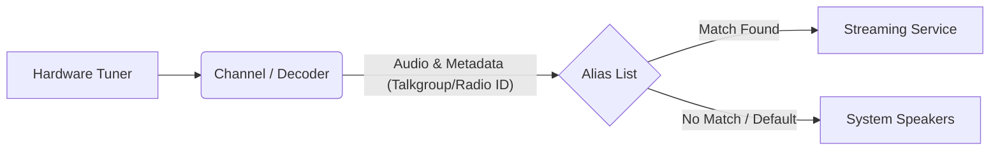

# How Channels, Aliases, and Streaming Work Together

Understanding how signal flow works in SDRTrunk is crucial for setting up your environment effectively. The core concept revolves around a linear path from raw radio waves to decoded audio streams, passing through three critical components: Channels, Aliases, and Streaming.

## The Core Interaction Logic

The system follows a specific sequence to process and route audio. A frequency is received and decoded into audio packets and metadata. This metadata is then compared against your Alias list. If a match is found, the system applies the routing rules defined in that Alias, which may include forwarding the audio to a specific Streaming service.

 

---

## 1. Channels (The Receiver)

Channels are the entry point. They define **what frequency you are listening to and how to decode it** (e.g., P25, DMR, NBFM).

*   **Goal:** Capture RF signals and extract digital or analog audio along with metadata (like Talkgroup IDs or Radio IDs).
*   **Where to find it:** `View -> Playlist Editor -> Channels`

## 2. Aliases (The Router)

Aliases are the intelligence of the system. They act as a lookup table and routing matrix. When a Channel decodes metadata (like a Talkgroup ID), it checks the Alias list.

*   **Goal:** Identify *who* is talking based on identifiers and determine *where* their audio should go.
*   **Where to find it:** `View -> Playlist Editor -> Aliases`

### Alias Component Map

| Component | Description |
| :--- | :--- |
| **Identifier** | The exact ID to look for (e.g., Talkgroup `12345` or Radio ID `9876`). |
| **Name** | A human-readable label (e.g., "Fire Dispatch"). |
| **Listen** | Toggle whether this traffic should be played or ignored. |
| **Audio Output Device** | Route audio to a specific Virtual Audio Cable or speaker. |
| **Streaming** | Toggle to send this audio to connected broadcasting services. |

## 3. Streaming (The Destination)

Streaming configurations define external services where decoded audio can be sent (e.g., Broadcastify, Zello, OpenMHz).

*   **Goal:** Establish a connection to an external service to broadcast audio.
*   **Where to find it:** `View -> Streaming`

---

## Step-by-Step Setup Example

Here is a typical workflow to set up a new dispatch feed to an external service:

1.  **Configure the Channel:** Create a new Channel in the Playlist Editor, set the frequency, and select the appropriate decoder (e.g., P25 Phase 1).
2.  **Create the Alias:** In the Alias list, add a new Alias. Set the identifier to the specific Talkgroup you want to stream.
3.  **Enable Streaming on the Alias:** In the detail panel for the new Alias, ensure the **Streaming** toggle is enabled.
4.  **Configure the Streaming Service:** Open the Streaming Editor (`View -> Streaming`). Add a new service (e.g., Zello or Broadcastify) and enter your credentials.
5.  **Start Broadcasting:** Ensure the streaming service is enabled and saved. When traffic on the configured Talkgroup is decoded by the Channel, the Alias will route it to the active Streaming service.

> **Tip**
> If you are not hearing audio on your stream, check the Alias settings first. The most common mistake is forgetting to enable the "Streaming" toggle on the specific Alias you wish to broadcast.
