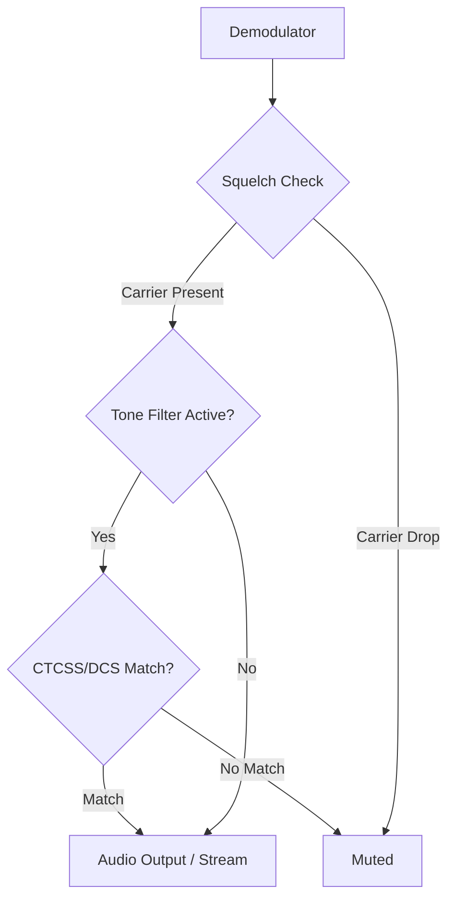

# CTCSS & DCS Sub-Audible Tone Filtering

**Goal:** Understand how to configure Continuous Tone-Coded Squelch System (CTCSS) and Digital Coded Squelch (DCS) to filter out unwanted interference on analog NBFM channels.

When monitoring shared analog frequencies, multiple agencies or systems may use the same frequency. CTCSS and DCS are sub-audible signaling methods used to ensure you only hear the transmissions meant for the specific group you are trying to monitor. SDRTrunk Kennebec allows you to configure these tone filters directly on an NBFM channel.

## Signal Flow Overview

The squelch filtering logic works sequentially:

## How to Configure CTCSS / DCS

Tone squelch is configured per-channel in the **Playlist Editor**.

### Step 1: Open the Channel

1. Navigate to the **Playlist Editor** -> **Channels**.
2. Select your existing NBFM channel, or create a new one.

### Step 2: Add Tone Filters

1. In the channel's detailed configuration pane, scroll down to the **Audio Processing** or **Squelch** section.
2. Click **Add Tone Filter**.
3. Select either **CTCSS** or **DCS** from the dropdown menu.
4. Input the desired tone (e.g., `100.0 Hz` for CTCSS or `023` for DCS).

### Step 3: Mix and Match

You can add multiple CTCSS or DCS entries to a single channel. Audio passes when **any** of the configured tones are detected. This is highly useful if a repeater is shared by multiple agencies using different squelch codes.

## Squelch Tail Removal

When using CTCSS/DCS, the transmitter drops the tone slightly before dropping the carrier. SDRTrunk Kennebec handles this gracefully.
By default, **Squelch tail removal** trims the noise burst at the end of a transmission. You can also configure **squelch head removal** (default 0 ms) to trim CTCSS tone ramp-up noise from the start of each transmission for a cleaner listening experience.

> **Note**
>
> AM channels do not support sub-audible tone squelch (CTCSS/DCS). The squelch on AM channels is carrier-based only.
