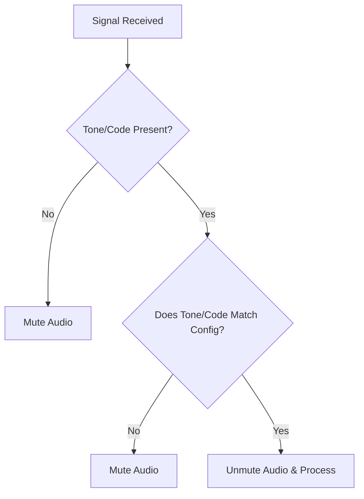

## Goal
Filter out unwanted analog or digital interference using specific tones (CTCSS/DCS) or network codes (NAC).

# CTCSS / DCS / NAC Filtering

To prevent your radio scanner from stopping on static or interference, Kennebec allows you to enforce strict filtering so you only hear the intended agency.

## Filtering Logic

## Quick Start

1. Open the **Playlist Editor** and select your channel.
2. Under the **Squelch / Filtering** tab, locate the **Tone/Code Filter**.
3. Select your desired filter type (CTCSS, DCS, or NAC).
4. Enter the required tone value or hexadecimal code.

> **Note:**
> If you are unsure of the correct CTCSS tone, SDRTrunk can display active tones in the Now Playing window during a transmission.

## Advanced Configuration

For advanced environments, you can configure the filtering to "Exclude" specific tones. This is useful if multiple agencies share a frequency, and you want to listen to all of them *except* one specific agency by filtering out their unique CTCSS tone.

## UI Component Map

| Component | Function |
| --- | --- |
| **Filter Type Dropdown** | Choose between None, CTCSS, DCS, or NAC. |
| **Value Input Field** | Enter the expected frequency (Hz) for CTCSS, digital code for DCS, or hex value for NAC. |
| **Invert/Exclude Checkbox** | Mute the channel if the tone *matches* instead of unmuting. |

## Related Topics
* [Playlist Editor Details](playlist-editor.md)
* [Analog Channels](analog.md)
