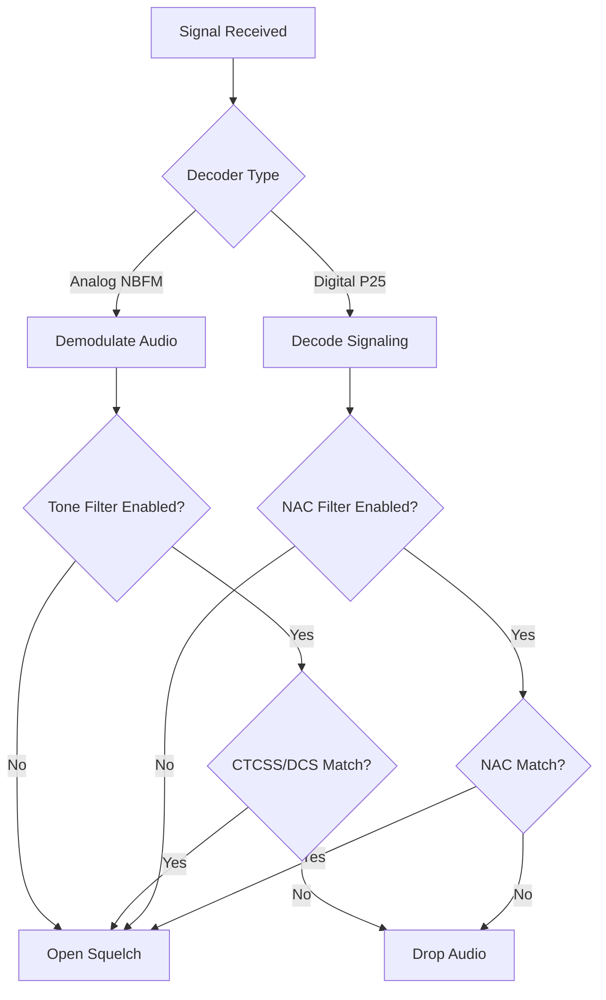

# CTCSS, DCS, and NAC Filtering

## Goal
Learn how to configure tone and code filtering in SDRTrunk to eliminate unwanted interference from analog and digital systems sharing the same frequency.

## Visual Flow: Squelch & Filtering Pipeline

## What is Tone and Code Filtering?
When monitoring conventional (non-trunked) radio systems, you may encounter multiple agencies or systems transmitting on the exact same frequency. To prevent users from hearing each other, these systems use sub-audible tones (CTCSS/DCS for analog) or digital codes (NAC for P25) as a squelch gate.

SDRTrunk Kennebec can mimic this behavior, opening the audio squelch only when the correct tone or code is present on the received signal.

## 1. CTCSS and DCS Filtering (Analog / NBFM)
Continuous Tone-Coded Squelch System (CTCSS) uses a sub-audible tone (e.g., 156.7 Hz) transmitted beneath the voice. Digital Coded Squelch (DCS) uses a continuous low-speed digital pattern (e.g., 023).

### Step-by-Step Setup
1. Open the **Playlist Editor** (`View -> Playlist Editor`) and select your target **NBFM** channel.
2. Scroll down to the **Decoder** configuration tab.
3. Toggle **Tone Filter Enabled** to the ON position.
4. Click **Add Tone Filter**.
5. In the new row, set the **Type** to either `CTCSS` or `DCS`.
6. Select the exact tone frequency or DCS code from the dropdown menu.
7. Click **Save**.

> **Warning**
> If you enable Tone Filtering but do not add any filters to the list, SDRTrunk will drop all audio for that channel.

## 2. NAC Filtering (Digital / P25)
Project 25 (P25) systems broadcast a 12-bit Network Access Code (NAC) on every transmission. Filtering by NAC allows you to ignore P25 transmissions from distant, co-channel systems.

### Step-by-Step Setup
1. Open the **Playlist Editor** and select your target **P25 Phase 1** or **Phase 2** channel.
2. Scroll down to the **Decoder** configuration tab.
3. Locate the **NAC Filter** setting and toggle it ON.
4. Enter the hexadecimal NAC code (e.g., `293` or `1A4`) for the system you want to monitor.
5. Click **Save**.

> **Tip**
> You can find the correct CTCSS, DCS, or NAC values for your local agencies by searching their frequency listings on RadioReference.com.
