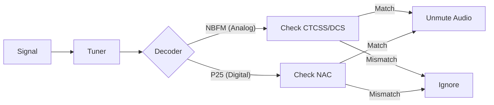

# CTCSS / DCS / NAC Filtering

### Goal
Learn how to use Continuous Tone-Coded Squelch System (CTCSS), Digital-Coded Squelch (DCS), and Network Access Code (NAC) filtering to isolate specific transmissions and reject unwanted interference.

### Visual Flow: Tone Filtering Logic

### Configuring CTCSS/DCS for Analog (NBFM)
When setting up an NBFM channel, you can configure it to only unmute when a specific sub-audible tone is present.

| Tone Filter Settings | Description |
| :--- | :--- |
| **Tone Type** | Select either `CTCSS` or `DCS`. |
| **Code** | Select the specific PL Tone (e.g., `100.0 Hz`) or DCS Code. |

1. Open the **Channels** tab and select an **NBFM** channel.
2. In the **Editor Panel**, scroll down to the **Tone Filter** section.
3. Select the desired **Tone Type** (`CTCSS` or `DCS`).
4. Select the matching tone or code from the dropdown.

> **Tip:** If you import channels via the **Radio Reference Import** tool, CTCSS/DCS tones are automatically configured for you!

### Configuring NAC for P25
Project 25 (P25) systems use a Network Access Code (NAC) instead of analog tones to distinguish between co-channel users.

| P25 Settings | Description |
| :--- | :--- |
| **NAC Override** | Forces the channel to only decode traffic matching this specific hex code (e.g., `293`). |

1. Open the **Channels** tab and select a **P25** channel.
2. In the **Editor Panel**, locate the **NAC Override** setting.
3. Enter the hexadecimal NAC code. The channel will now ignore P25 traffic with a differing NAC.
