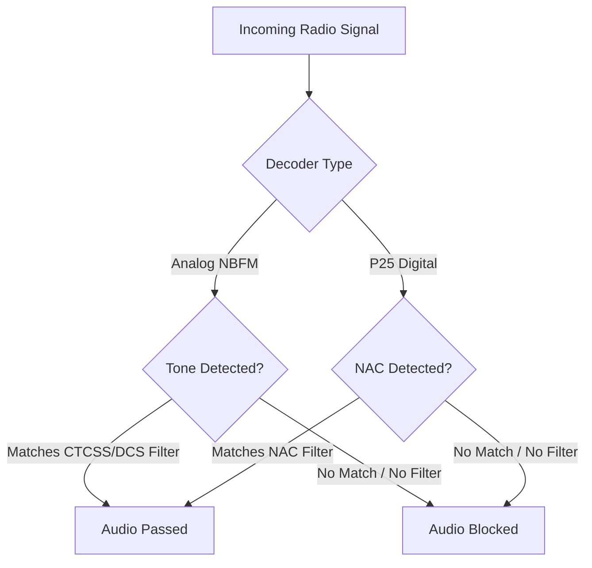

# CTCSS, DCS, and NAC Filtering

## Goal
Learn how to configure CTCSS, DCS, and NAC filters to ensure you only hear the specific agencies or repeaters you want on a shared frequency.

SDRTrunk Kennebec allows you to filter incoming transmissions using sub-audible analog tones (CTCSS), digital codes (DCS), or Network Access Codes (NAC) for P25 systems.

## The Filtering Signal Flow

## Configuring CTCSS & DCS for Analog Channels

Continuous Tone-Coded Squelch System (CTCSS) and Digital Coded Squelch (DCS) are used on analog NBFM channels to separate users sharing the same frequency.

### How to Add an Analog Tone Filter

1.  **Open the Playlist Editor**
    Go to **View** > **Playlist Editor** and select the **Channels** tab.
2.  **Select an NBFM Channel**
    Click on the analog channel you want to configure, or create a new NBFM channel.
3.  **Add a Tone Filter**
    In the channel details panel, locate the **Tone Filters** section and click **Add Tone Filter**.
4.  **Configure the Filter**
    *   **Type:** Select either **CTCSS** or **DCS**.
    *   **Tone/Code:** Choose the specific tone frequency (e.g., 100.0 Hz) or DCS code from the dropdown menu.
5.  **Save the Channel**
    Click **Save** to apply the changes.

> **Tip**
> You can add multiple tone filters to a single channel. SDRTrunk will open the squelch if *any* of the configured tones are detected.

## Configuring NAC Filtering for P25 Channels

The Network Access Code (NAC) is a 12-bit value (0–4095) used in P25 digital systems to identify specific networks or repeaters.

### How to Enable NAC Filtering

1.  **Open the Playlist Editor**
    Go to **View** > **Playlist Editor** and select the **Channels** tab.
2.  **Select a P25 Channel**
    Click on the P25 Phase 1 or Phase 2 channel you want to configure.
3.  **Enable the Filter**
    Check the **NAC Filter** box in the channel details panel.
4.  **Add NAC Values**
    Add the specific NAC value(s) for your target system. You can enter them in decimal or hexadecimal format.
5.  **Save the Channel**
    Click **Save** to apply the changes. SDRTrunk will now discard any P25 messages that do not match the configured NAC values.
