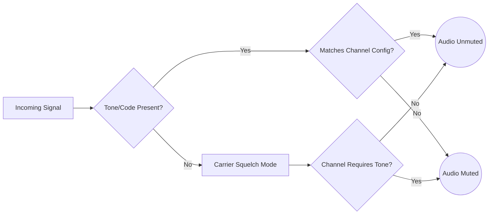

## Goal
Learn how to configure CTCSS, DCS, and NAC filtering to block unwanted transmissions and ensure you only hear the traffic you want on analog and digital channels.

## Understanding Squelch Tones & Codes
Squelch tones are essentially "passwords" transmitted alongside voice audio. Your receiver must have the matching "password" configured to open the audio path.

- **CTCSS** (Continuous Tone-Coded Squelch System): A sub-audible analog tone.
- **DCS** (Digital-Coded Squelch): A continuous stream of sub-audible digital data.
- **NAC** (Network Access Code): A 12-bit code embedded in P25 digital transmissions.

### Visual Flow: How Filtering Works

## Step-by-Step Configuration

### 1. Navigating to the Channel Configuration
1. Open the **Channels** tab.
2. Select the Channel you wish to configure.
3. Ensure the channel is stopped to edit the settings.

### 2. Setting up Analog Tones (CTCSS/DCS)
1. In the Channel Editor, locate the **Squelch** section.
2. Set the Squelch Type to **CTCSS** or **DCS**.
3. A new dropdown will appear. Select the specific tone (e.g., `156.7 Hz`) or code (e.g., `023`) you want to require.

### 3. Setting up P25 NAC Filtering
1. In the P25 Channel Editor, locate the **NAC** section.
2. By default, it is usually set to `$F7E` (Receiver acts in Carrier Squelch mode, accepting any NAC).
3. Enter the specific hexadecimal NAC for the system you want to monitor (e.g., `$293`).

> **Tip:** If you see "P25 NAC Override" mentioned in the settings, this feature allows you to bypass the channel's default NAC for specific alias configurations.

## Troubleshooting
- **Hearing nothing?** Double-check that your tone or code is exactly correct. A mismatch will mute all audio.
- **Hearing static or interference?** You might be using "Carrier Squelch" (no tone configured) on an analog channel. Add a CTCSS/DCS tone to filter out the noise.
