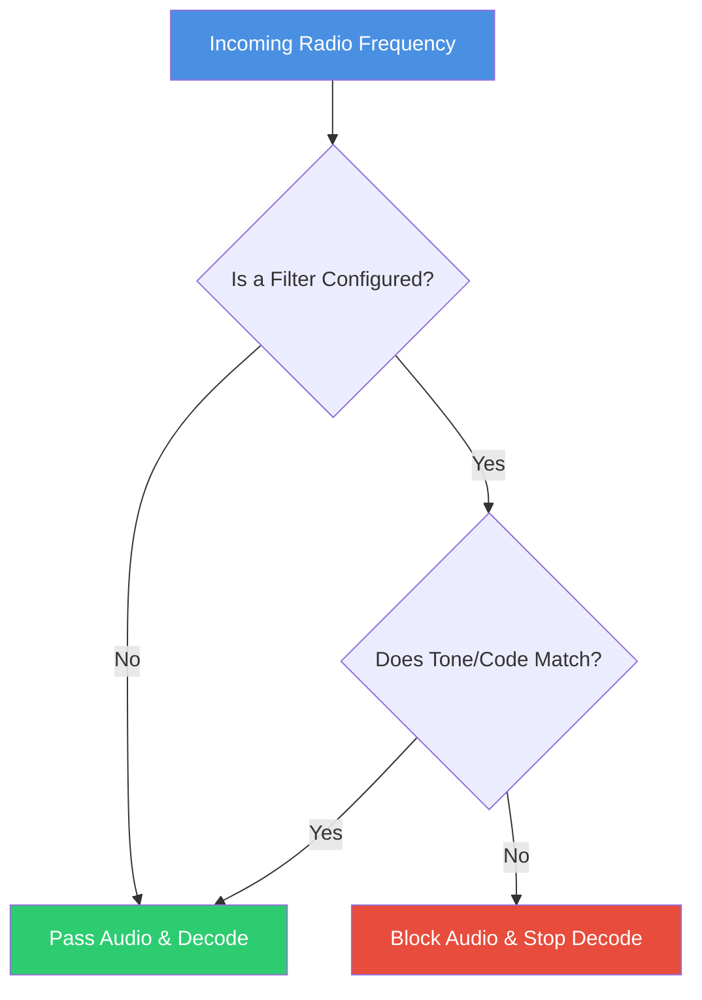

# CTCSS / DCS / NAC Filtering

## Goal

To learn how to filter incoming analog and digital radio signals to eliminate unwanted interference or restrict reception to specific user groups.

This is particularly useful when multiple groups share the same frequency but use different sub-audible tones (CTCSS/DCS) or network access codes (NAC).

## The Filtering Logic

When a filter is applied to a channel, SDRTrunk evaluates incoming signals before attempting to decode or play audio.

### Analog Filtering (NBFM)
For analog channels (NBFM), you can configure either **CTCSS** (Continuous Tone-Coded Squelch System) or **DCS** (Digital-Coded Squelch).
* **CTCSS** uses a continuous sub-audible sine wave (e.g., 100.0 Hz).
* **DCS** uses a continuous digital data stream representing a 3-digit octal code.

### Digital Filtering (P25)
For P25 digital channels, you can configure a **NAC** (Network Access Code). A NAC is a 12-bit code embedded in every voice packet.

---

## Configuring a Filter

### Step-by-Step Guide: Analog (CTCSS/DCS)
1. Navigate to the **Playlist Editor** tab.
2. Select your **NBFM** channel from the list.
3. In the channel configuration panel, locate the **Tone Filter** section.
4. Check the box to **Enable Tone Filter**.
5. Select the **Tone Type** (`CTCSS` or `DCS`) from the dropdown.
6. Select the specific code from the adjacent dropdown.
   * *Tip:* When importing from Radio Reference, SDRTrunk automatically populates these fields based on the imported tone data.

### Step-by-Step Guide: Digital (P25 NAC)
1. Navigate to the **Playlist Editor** tab.
2. Select your **P25** channel from the list.
3. In the channel configuration panel, locate the **Decoder & System** section.
4. Enter the required **NAC** code (in hexadecimal format, e.g., `293`).
5. Ensure the "Allow any NAC" or equivalent pass-through option is disabled if you strictly want to filter by this NAC.

---

## Troubleshooting Filters

If you configure a filter but hear nothing, check the following:
* **Are you using the right format?** P25 NACs are hexadecimal, not decimal.
* **Is the system actually transmitting the tone?** Some systems only broadcast the tone during actual voice transmission, not during idle carrier periods. You can use the **Spectrum & Waterfall** display to verify signal presence.
* **Is the tone inverted?** For DCS, some radios use an inverted code. Try the standard code first; if it fails, check documentation to see if an inverted variant is expected.
