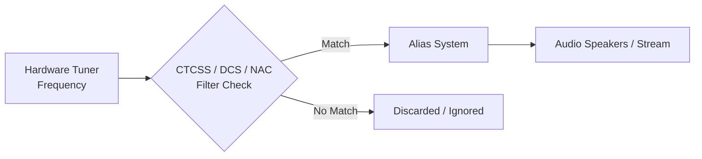

# CTCSS / DCS / NAC Filtering

When monitoring radio systems, you often share a single frequency with multiple agencies or neighboring systems. SDRTrunk provides powerful tools to filter out unwanted analog and digital interference, ensuring you only hear the traffic you want. This is accomplished using **CTCSS / DCS** for analog signals (NBFM) and **NAC** (Network Access Code) for P25 digital systems.

## Visual Flow: How Filtering Works

When a transmission is received, the incoming signal passes through a filter. If the signal has the correct tone or code configured in SDRTrunk, the squelch opens, and the audio reaches your aliases and speakers.

## CTCSS and DCS Filtering (Analog NBFM)

**Continuous Tone-Coded Squelch System (CTCSS)** and **Digital Coded Squelch (DCS)** are sub-audible signals transmitted simultaneously with an analog voice transmission. They are commonly known as "PL Tones" (Private Line) or "DPL" (Digital Private Line).

You can configure SDRTrunk to pass audio only when the specific CTCSS tone or DCS code is detected on a narrowband FM (NBFM) channel.

### Setting up CTCSS / DCS

  **1. Select your NBFM channel**
    Open the **Playlist Editor** (`View -> Playlist Editor`) and select the NBFM channel you want to configure under the **Channels** section.

  **2. Enable tone filtering**
    In the **Decoder** configuration section for your channel, toggle **Tone Filter Enabled** to on.

  **3. Add a Tone Filter**
    Click **Add Tone Filter**, then select the type:
    * **CTCSS**: Select the correct tone frequency from the dropdown (for example, `100.0 Hz` or `127.3 Hz`).
    * **DCS**: Select the correct DCS code from the dropdown (for example, `023` or `445`).

  **4. Save the channel**
    Click **Save**. The channel will now filter out any traffic on this frequency that does not include the specified CTCSS/DCS tone or code.

> **Tip**
>
> You can add multiple CTCSS/DCS filters to a single channel. Audio will pass when **any** of the configured codes are detected. This is very useful if you are monitoring a repeater that is shared by multiple agencies using different squelch codes.

> **Warning**
>
> When tone filtering is enabled but the tone filter list is empty, **no audio will pass**. Always add at least one filter after enabling this option.

## NAC Filtering (P25 Digital)

The **Network Access Code (NAC)** is a 12-bit value (0–4095) broadcast on all P25 digital systems. It operates similarly to a PL Tone on analog systems, allowing receivers to identify messages specifically intended for their system and reject interference from adjacent systems that might be reusing the same frequency.

### Setting up NAC Filtering

  **1. Select your P25 channel**
    Open the **Playlist Editor** and select the P25 channel you want to configure.

  **2. Enable NAC Filtering**
    Toggle **NAC Filter** to enabled in the channel's configuration.

  **3. Add Allowed NAC Values**
    Add the allowed NAC value(s) for your target system.

  **4. Save**
    Click **Save**. SDRTrunk will discard all digital messages and voice traffic that do not match the configured NAC values.
