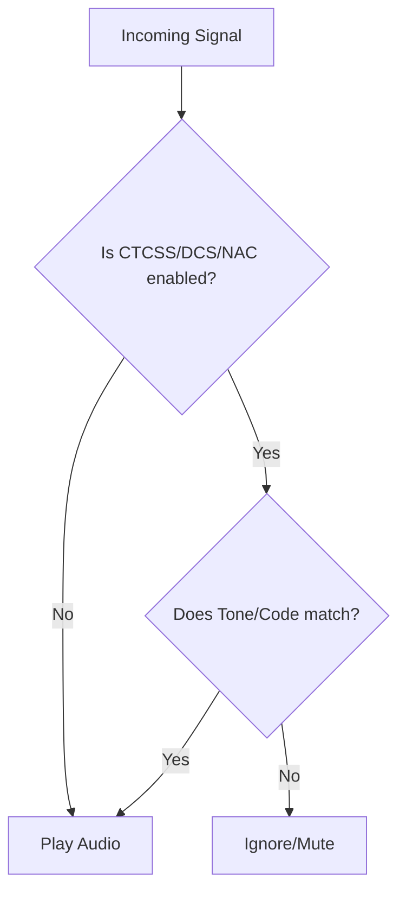

## Goal
Filter out unwanted analog or digital interference using specific tones and codes, such as CTCSS, DCS, and NAC.

## Visual Flow

## Step-by-Step

### Analog Tones (CTCSS / DCS)
1. Open the **Channel Editor** for your target analog channel.
2. Locate the **Squelch** section.
3. Select either **CTCSS** or **DCS** from the Tone Type dropdown.
4. Choose the specific tone/code you wish to filter on. The channel will now only unmute for transmissions matching this tone.

### Digital Codes (P25 NAC)
1. Open the **Channel Editor** for your target P25 channel.
2. Locate the **System Settings** or **NAC** field.
3. Enter the hexadecimal NAC code. The software will filter out traffic from other systems sharing the frequency.

## See Also
- [Ignore Unwanted Talkgroups](ignore-unwanted-talkgroups.md)
- [P25 Overrides](p25.md)
