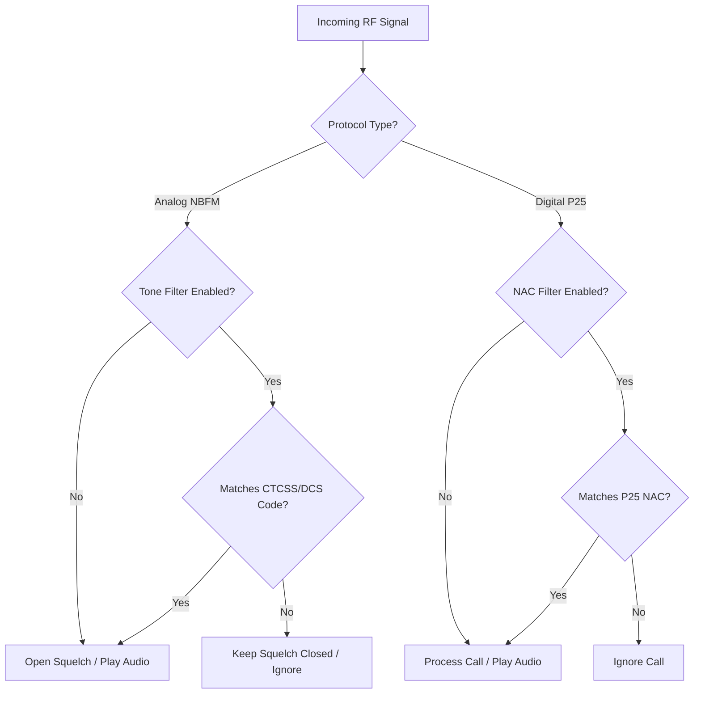

# CTCSS / DCS / NAC Filtering

## Goal
The "CTCSS / DCS / NAC Filtering" features in SDRTrunk Kennebec allow you to filter out unwanted analog or digital interference using specific sub-audible tones and network access codes. This ensures that you only hear traffic intended for the system or agency you are monitoring, even on shared or crowded frequencies.

## Understanding the Filters

Different radio protocols use different mechanisms to differentiate traffic on shared frequencies.

- **CTCSS (Continuous Tone-Coded Squelch System):** Used on analog (NBFM) channels. A continuous sub-audible tone (e.g., `100.0 Hz`) is transmitted alongside the voice. The receiver only opens the squelch if it detects the correct tone.
- **DCS (Digital-Coded Squelch):** Used on analog (NBFM) channels. Similar to CTCSS, but uses a continuous digital code (e.g., `023`) instead of an analog tone.
- **NAC (Network Access Code):** Used on P25 digital systems. A 12-bit code (e.g., `293`) that identifies a specific P25 network. The receiver discards messages from other networks operating on the same frequency.

## Visual Flow: Squelch & Filtering Logic

## How to Configure CTCSS / DCS Filtering (Analog)

You can configure CTCSS and DCS tone filtering on conventional analog NBFM channels.

1. Open the **Playlist Editor**.
2. Select the **Channels** section and click on your target **NBFM** channel.
3. In the channel's Decoder settings, locate **Tone Filter Enabled** and toggle it to the **ON** position.
4. Click **Add Tone Filter**.
5. Select the **Type** (`CTCSS` or `DCS`).
6. Select the specific tone frequency or DCS code from the dropdown. You can add multiple tones to a single channel if multiple agencies share the repeater using different tones.
7. Click **Save**.

> **Warning:**
  If you enable **Tone Filter Enabled** but do not add any tone filters to the list, SDRTrunk will block *all* audio on that channel because no valid tones have been defined.

## How to Configure NAC Filtering (P25)

You can configure NAC filtering on P25 Phase 1 or Phase 2 channels to isolate traffic from a specific system.

1. Open the **Playlist Editor**.
2. Select the **Channels** section and click on your target **P25** channel.
3. In the channel's Decoder settings, locate the **NAC Filter** option and enable it.
4. Add the allowed Network Access Code(s) (e.g., `293` or `1A0`) to the filter list. You can find your system's NAC on RadioReference.
5. Click **Save**.

Once enabled, SDRTrunk Kennebec will immediately discard any P25 messages that do not match the configured NAC values, keeping your event log clean and preventing interference from neighboring systems on the same frequency.
