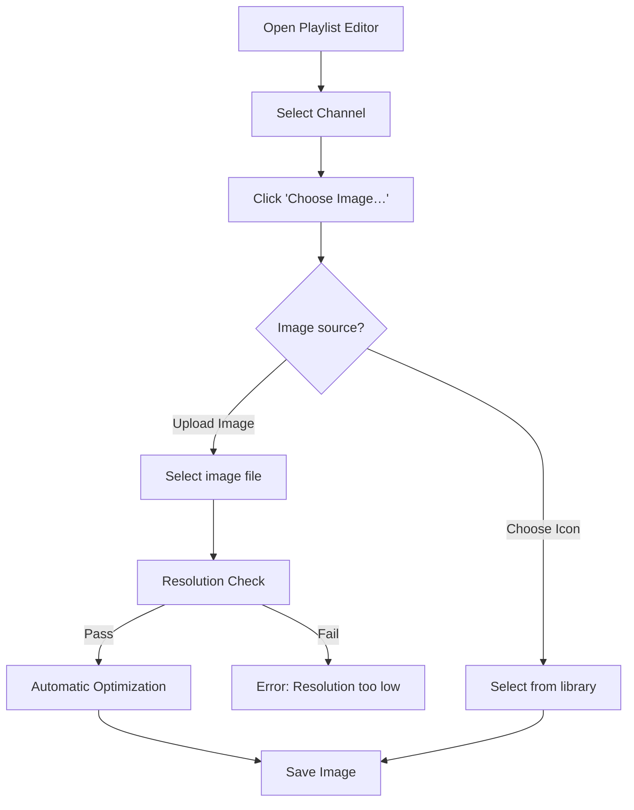

# Custom Channel Image Guide

You can now upload custom images (logos, emblem badges, dispatcher photos) for any of your active channels! This helps you easily identify channels visually in the interface.

## Setting up a Custom Channel Image

1. Open the **Playlist Editor**.
2. Select a channel from the **Channels** section.
3. In the detail editor panel, locate the **Channel Image** row.
4. Click the **Choose Image…** button.
5. Select either **Upload Image...** or **Choose Icon...**.
    - If you selected **Upload Image...**, select your image file. The upload dialogue verifies image dimensions. Any image smaller than `64x64` pixels is rejected. High-resolution source images are automatically processed on a fast background thread, scaled down to `128x128` pixels using high-quality bilinear filtering, optimized as clean PNGs, and saved to a local persistent folder.
    - If you selected **Choose Icon...**, select an icon from the library in the dialog.
6. The image will be previewed. If you want to clear it, click the **Clear** button next to it.
7. Click **Save** in the detail editor.

## Viewing Custom Images

When a channel is actively decoding, its custom image is displayed inside a beautiful circular squircle on the sticky top playback bar. When the channel goes idle, the squircle elegantly resets to a default waveform gradient.

## Diagram

