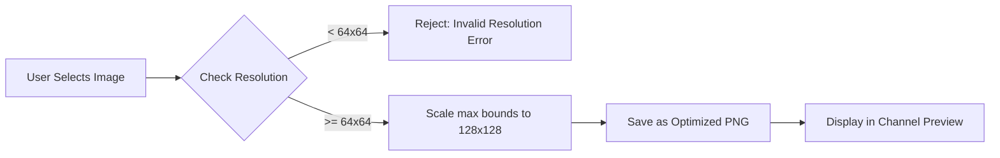

# Custom Channel Images

**Goal:** Learn how to customize your channels by uploading custom artwork to make identifying active calls easier.

SDRTrunk Kennebec introduces an image upload pipeline that scales and optimizes your custom channel imagery.

## Visual Flow: Image Processing Pipeline

## Step-by-Step Configuration

1. Navigate to the channel configuration.
2. Click the **Choose Image…** button (or "Choose Icon..." from the dropdown menu).
3. Select an image from your computer (`.png`, `.jpg`, `.jpeg`, `.gif`, or `.bmp`).
4. **Resolution Check:** The system verifies the image. If it is smaller than `64x64` pixels, it will be rejected with an "Invalid Resolution" error to ensure sharp display quality.
5. **Optimization:** If valid, the image is scaled proportionally to a maximum of `128x128` pixels and saved as a PNG format.
6. The preview will update immediately. To remove the custom artwork later, simply click the **Clear** button that appears.
