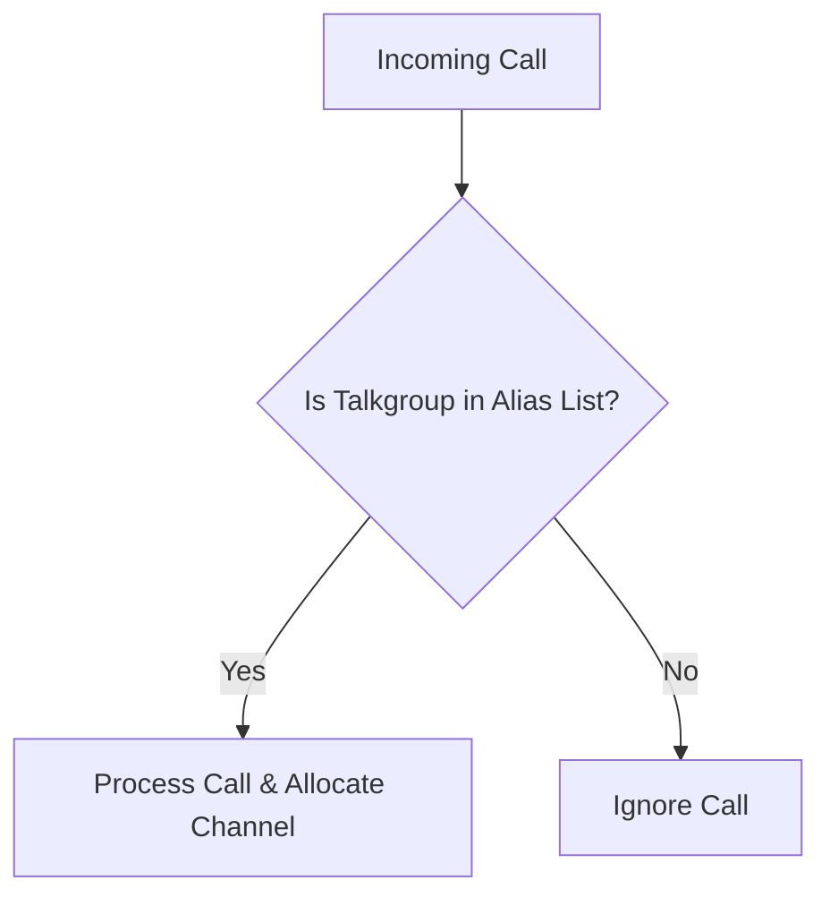

# Ignore Unwanted Talkgroups

> Configure SDRTrunk Kennebec to ignore traffic from talkgroups that are not explicitly defined in your alias list.

The "Ignore Unaliased TGs" feature prevents SDRTrunk Kennebec from processing and allocating traffic channels for talkgroups that you have not explicitly named and saved in your assigned alias list. This is particularly useful for busy systems where you only want to monitor a specific subset of talkgroups and ignore everything else.

## Supported Protocols

This feature is available for:
* **DMR** (Digital Mobile Radio)
* **P25 Phase 1**
* **P25 Phase 2**

## How it Works

## Configuration

You can enable this feature individually for each channel in your playlist.

1. Open the **Playlist Editor**.
2. Select the **Channels** tab.
3. Select your desired DMR, P25 Phase 1, or P25 Phase 2 channel to open its configuration editor.
4. Locate the **Ignore Unaliased TGs** toggle switch.
5. Toggle the switch to **Enabled**.
6. Ensure that you have assigned an **Alias List** to this channel. The feature relies on this list to determine which talkgroups are "wanted."
7. Click **Save** to apply the changes.

> [!NOTE]
  If you enable "Ignore Unaliased TGs" but do not assign an alias list to the channel, all traffic on that channel will be ignored because no talkgroups are defined.
