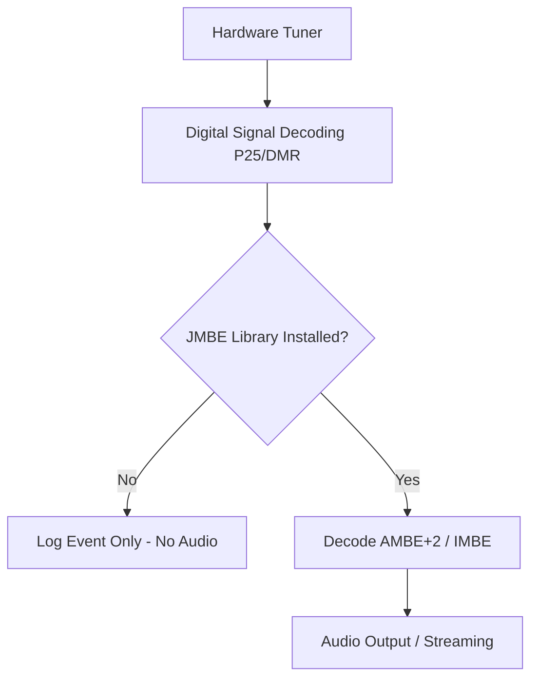

# Compiling and Setting Up the JMBE Audio Library

## Goal
To configure the JMBE library required for decoding and playing digital voice audio from P25 and DMR channels.

SDRTrunk Kennebec uses the external **JMBE (Java Multi-Band Excitation)** library to decode digital voice codecs such as AMBE+2 and IMBE, which are used in protocols like P25 Phase 1 & 2 and DMR.

Because of patent considerations surrounding the AMBE vocoder, the JMBE library **is not bundled** with SDRTrunk Kennebec. You must compile and link this library yourself before you can hear decoded digital audio.

Without the JMBE library installed, SDRTrunk Kennebec will still decode all P25 and DMR signaling, and talkgroup activity will appear in the event log, but **no audio will play**.

## Creating the JMBE Library

SDRTrunk Kennebec provides an automated tool to download the JMBE source code and compile it directly from the application interface.

  **1. Open User Preferences**

    Go to **View** → **User Preferences** in the menu bar.

  **2. Navigate to JMBE Settings**

    Select **Audio** → **JMBE Audio Library** in the left sidebar of the **User Preferences** panel.

  **3. Compile the Library**

    Click the **Create Library** button. SDRTrunk Kennebec will contact GitHub to find the latest source code, download it, and compile the JAR file locally.

    If an update is available, you will be prompted to confirm the download.

  **4. Verify Setup**

    Once compilation finishes, the **File:** path will update to point to your new `jmbe-*.jar` file, and the **Current Version:** label will display the installed release.

## Standard vs. Bazineta Fork

The JMBE library has two primary variants available: the standard open-source release, and the "Bazineta" fork.

| Feature | Standard JMBE | Bazineta Fork |
| --- | --- | --- |
| **Origin** | Original mbelib port | Community-optimized fork |
| **Compatibility** | Broadest compatibility | Optimized for Kennebec |
| **P25 Phase 2 Support** | Yes | Yes, with enhanced error correction |

> **Tip**
>
  The **Bazineta Fork** is recommended for SDRTrunk Kennebec users, as it includes specific fixes and optimizations that improve audio quality on marginal P25 Phase 2 signals.

To use the Bazineta fork, simply ensure the **Use Bazineta Fork** checkbox is enabled in the **JMBE Audio Library** preferences *before* clicking **Create Library**.

## Managing Your JMBE File

If you have already compiled a JMBE library on another machine or from a previous installation, you do not need to recompile it.

  **Link an Existing Library**

    In the **JMBE Audio Library** preferences, click **Select...** and browse to the location of your existing `jmbe-*.jar` file.

  **Reset Library Path**

    Click **Reset** to clear the current library configuration. This is useful if you moved the file or want to force a fresh compilation.

> **Warning**
>
  Do not move or delete the compiled `jmbe-*.jar` file while SDRTrunk is running, as it will break audio decoding immediately. If you need to relocate the file, close SDRTrunk first, move the file, and then use the **Select...** button to update the path.
