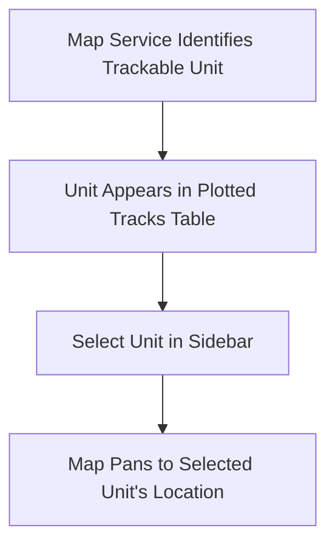

# Map Panel & Track Plotting

SDRTrunk Kennebec features an integrated map viewer that allows you to plot and track radio identifiers in real time using OpenStreetMap data.

## Goal
Learn how to navigate the Map Panel, view plotted tracks, and manage tracked entities visually.

## Visual Flow
Here is how the mapping logic operates:

## Map Navigation
The Map Panel uses standard map controls:
- **Pan:** Click and drag the map area to pan around.
- **Zoom In/Out:** Use your mouse scroll wheel to zoom in and out of the map.

## The Plotted Tracks Sidebar
The left sidebar contains a table of all actively plotted tracks.

1. **Select a Track:** Clicking on a row in the "Plotted Tracks" table will highlight that specific entity.
2. **View Details:** The panel below the table ("Selected System:") will update to show metadata about the selected track, such as its associated radio system.

> [!TIP]
> Ensure your map zoom is adjusted properly so that the tracked unit is clearly visible on the screen when plotting.

> [!NOTE]
> Map tiles are fetched dynamically from OpenStreetMap; a working internet connection is required to render the map completely.
