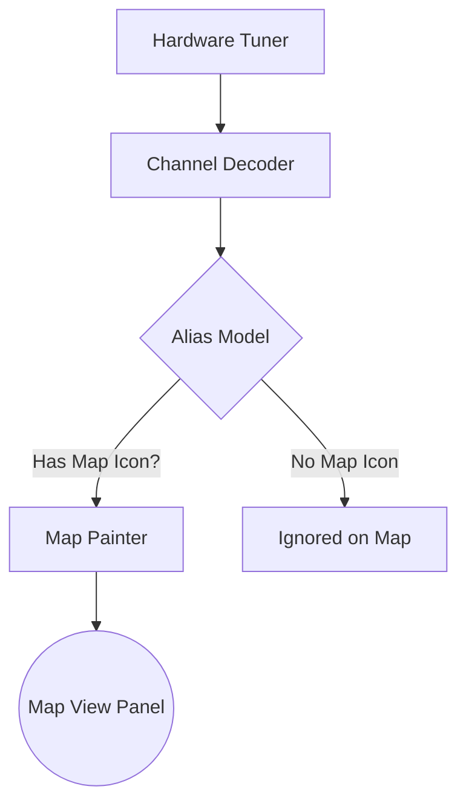

# Map View

## Goal

Learn how to use the Map View panel in SDRTrunk to visualize the geographic location and historical tracks of radio entities.

The **Map View** uses OpenStreetMap tiles to plot radio units, talkgroups, or sites based on alias configurations.

## Visual Flow: How Data Reaches the Map



## UI Structure

The Map View is an interactive map with several control options and track history functionality.

```text
+-------------------------------------------------------------+
|                                                             |
|                          Map Panel                          |
|                                                             |
|                                                             |
|   + - (Zoom In)                                             |
|                                                             |
|   - - (Zoom Out)                                            |
|                                                             |
|   O - (Center Map / Follow)                                 |
|                                                             |
|   * - (Map Options)                                         |
|                                                             |
|                                                             |
+-------------------------------------------------------------+
| [Follow] [(select a track) V] [X Center on Selection]       |
| [Clear Map] [Replot All] [Delete All] [Delete]              |
+-------------------------------------------------------------+
```

## Features & Controls

### Main Map Controls
- **Zoom In (+)**: Zooms the map closer.
- **Zoom Out (-)**: Zooms the map further out.
- **Follow Selected (Location Arrow)**: Centers the map continuously on the selected entity as it moves.
- **Map Options (Gear)**: Opens additional Map Settings.

### Track Controls
The track controls at the bottom of the map view manage the history of plotted entities.

- **Follow**: Toggles tracking the entity selected in the dropdown.
- **Entity Dropdown**: Lists all currently plotted tracks. Selecting one allows you to follow or delete it.
- **Center on Selection**: When checked, the map will automatically center when you select an entity in the dropdown.
- **Clear Map**: Clears the current view of the map, but keeps the underlying tracks in memory.
- **Replot All**: Redraws all tracks from memory onto the map.
- **Delete All**: Deletes the history for all tracked entities.
- **Delete**: Deletes the track history for the specific entity selected in the dropdown.

## Step-by-Step: Enabling Map Tracking

1. **Configure Alias with Icon**: To see an entity on the map, its Alias must be configured with an Icon.
   - Go to `Playlist Editor` -> `Aliases`.
   - Select or create an Alias.
   - In the Alias details, ensure an icon is selected under the Map settings.
2. **Enable Decoding**: Ensure you are actively decoding a system or channel where these aliases appear.
3. **Open Map View**: Navigate to the Map View panel. If entities with map icons transmit their locations, they will appear on the map.
4. **Interact**: Use the mouse to pan (click and drag) and scroll wheel to zoom. Use the Track Controls to select and follow specific units.

> **Note:** The Map View relies on an active internet connection to download map tiles from OpenStreetMap.
