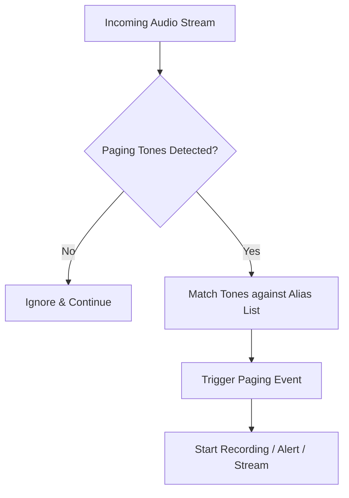

## Goal
Configure your SDRTrunk to decode and process Native Sequential Paging formats used in legacy dispatcher environments.

# Native Sequential Paging

SDRTrunk Kennebec introduces built-in support for Native Sequential Paging. This allows you to monitor and automate actions based on two-tone or multi-tone sequential paging alerts often used by fire departments and EMS.

## Paging Flow

## Quick Start

1. Open the **Playlist Editor**.
2. Select your channel from the left sidebar.
3. In the channel configuration, enable the **Sequential Paging** option.

> **Tip:**
> Ensure that your audio quality is clear, as static can interfere with tone detection.

## Advanced Configuration

Once sequential paging is enabled, you can customize how SDRTrunk responds to specific page tones by creating aliases. For example, you can assign different alert sounds depending on whether a "Fire Response" or "EMS Response" tone sequence is detected.

## UI Component Map

| Component | Function |
| --- | --- |
| **Tone 1/Tone 2 Fields** | Define the specific Hz frequencies for the paging tones. |
| **Alert Action** | Choose whether to play a sound or trigger an external webhook when the tones match. |
| **Recording Duration** | Set how long SDRTrunk should record the audio after the paging tones finish. |

## Related Topics
* [Playlist Editor Details](playlist-editor.md)
* [Analog Channels](analog.md)
