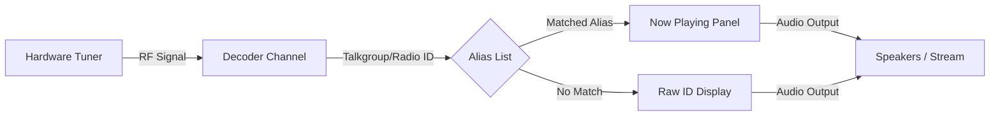

# Now Playing Panel Guide

## Goal
The **Now Playing** panel is your primary real-time dashboard in SDRTrunk. This guide explains how to read its layout, understand the flow of active calls, and navigate the interface to efficiently monitor radio traffic.

---

## Signal Flow Overview

Understanding how a signal reaches the Now Playing panel helps you troubleshoot and customize your setup.

---

## UI Component Map

The Now Playing panel is located in the main application window and consists of several key elements.

| Component | Description |
| --- | --- |
| **Status Indicator** | A colored dot or icon showing the current state (Idle, Call, Muted, No Tuner). |
| **Alias / ID Name** | Displays the matched Alias name (e.g., `Fire Dispatch`) or the raw numeric ID if unaliased. |
| **System & Site** | The name of the trunked system and specific site currently active. |
| **Action Icons** | Icons indicating active streams, recordings, or specific alerts for the call. |
| **Context Menu** | Accessed by right-clicking a row; allows quick actions like Mute/Unmute. |

---

## Step-by-Step Navigation

Follow these steps to familiarize yourself with the Now Playing panel:

  **1. Locate the Panel**

    After setting up your tuners and channels, look at the main SDRTrunk window. The **Now Playing** panel is prominently displayed, showing a live list of decoded channels.

  **2. Interpret the States**

    Observe the rows as calls come in. A row will light up or change state when a voice grant is active (Call). If a row is idle, the channel is running but no voice traffic is present.

  **3. Interact with a Call**

    Right-click on any active call row in the panel. A context menu will appear.

  **4. Mute or Unmute**

    From the context menu, select **Mute** to quickly silence a disruptive or uninteresting conversation. The row will indicate it is muted, and audio will stop playing for that specific call. Right-click and select **Unmute** to restore audio.

  **5. Customize the View (Optional)**

    If you want to change how IDs are displayed or assign specific colors to aliases for easier identification in this panel, navigate to the **Alias List** via the **Playlist Editor** and update your alias configurations.
