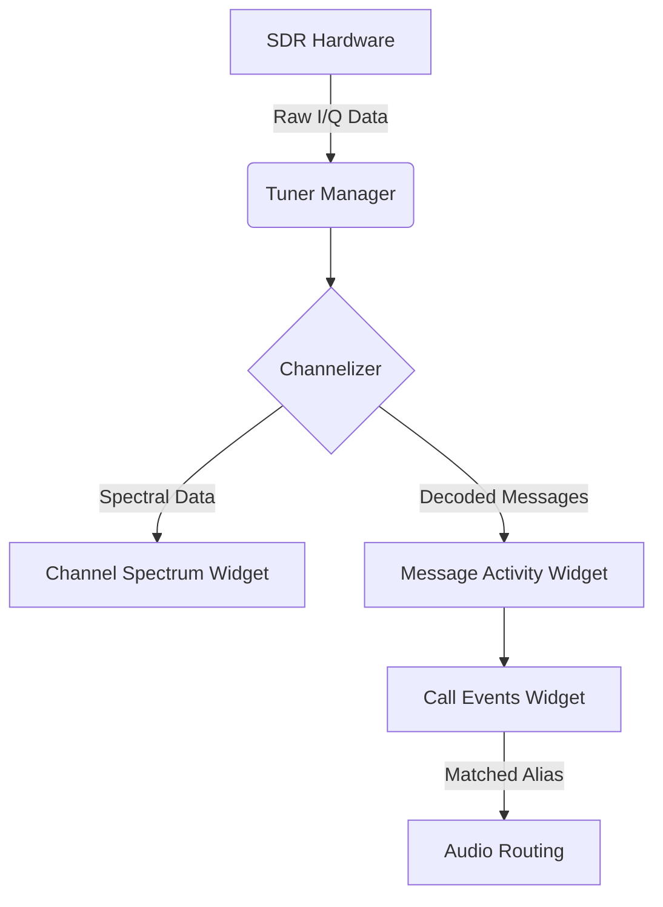

# Now Playing Panel

## Goal
The goal of this guide is to explain the Now Playing panel, how to manage its widgets, how to view call history, and how to understand the signal flow of monitored calls.

## Visual Flow (Call Lifecycle)

## Visual Overview

The Now Playing panel consists of a customizable grid of widgets. By default, it includes the following layout:

 

| Area | Widget Name | Description |
|---|---|---|
| **Top** | **Channel Spectrum** | Displays the RF spectrum and waterfall for active channels being decoded in real-time. |
| **Middle Left** | **Call Events** | A scrolling list of active and recent voice calls, showing the talkgroup alias, radio ID, and duration. |
| **Middle Right** | **Message Activity** | A real-time log of decoded control messages, such as channel grants, unit registrations, and status updates. |
| **Bottom** | **Resource Status** | Shows system health metrics, including CPU usage, memory consumption, and tuner status. |

 

## Managing Widgets

The layout of the Now Playing panel is built using a widget container system. You can hide, show, or rearrange these widgets.

### The Manage Widgets Menu

To customize the layout:

  **1. Open the Manage Widgets menu**

    Click the **Manage Widgets** button (the gear icon) located in the toolbar of the Now Playing panel.

  **2. Toggle widget visibility**

    A dropdown menu appears listing all available widgets (e.g., *Channel Spectrum*, *Call Events*, *Message Activity*, *Resource Status*).

  **3. Enable or disable widgets**

    Check or uncheck the box next to a widget's name to show or hide it.

> **Tip**
>
  Hiding widgets you don't use, such as the *Channel Spectrum* or *Message Activity*, can reduce CPU and memory usage, which is especially useful on lower-end systems.

### Persistent Layouts

SDRTrunk Kennebec remembers your widget selections. When you close and reopen the application, the Now Playing panel will restore the exact widgets and layout you had configured in your previous session.

## Monitoring Calls

The **Call Events** widget is the primary way to monitor voice traffic.

- **Active Calls**: Ongoing conversations are highlighted and display the current duration.
- **Audio Routing**: If a call matches an alias with a configured audio output (like a virtual audio cable), the audio will automatically route to that device.
- **History**: Recent calls remain in the list after they finish, allowing you to review past activity.

> **Note**
>
  Only calls that are actively being decoded by your configured channels will appear in the Now Playing panel. If you are missing traffic, ensure your channels are configured correctly and your tuners are covering the necessary frequencies.
