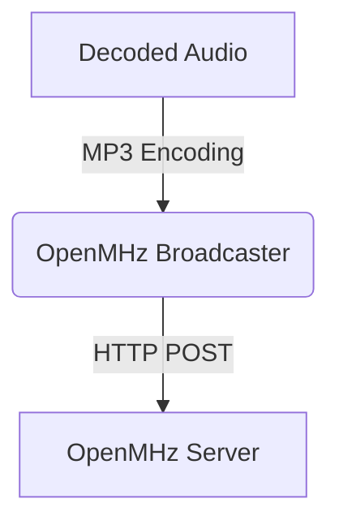

# Stream decoded radio audio to OpenMHz

> Configure SDRTrunk Kennebec to broadcast decoded radio audio to an OpenMHz server in real time.

SDRTrunk Kennebec can push completed, decoded radio audio directly to an OpenMHz server using its call upload API. This integration allows you to ingest audio calls seamlessly into your OpenMHz online radio archive platform.

## Audio Flow

## Adding an OpenMHz broadcaster

1. In SDRTrunk Kennebec, go to **View** > **Streaming**.
2. Click the **+** (Add) button.
3. Select **OpenMHz**.

## Configuration Fields

Fill in the required fields in the configuration panel:

| Field | Description |
| --- | --- |
| **Format** | Currently defaults to MP3. |
| **Name** | A label for this configuration, e.g. "My OpenMHz Stream". |
| **API Key** | Your OpenMHz API key for authentication. |
| **System Name** | Your system's short name as registered on OpenMHz (e.g. `countysheriff`). |
| **OpenMHz URL** | The base URL of the OpenMHz server. Defaults to `https://api.openmhz.com`. |

> **Note:**
  The `System Name` field should perfectly match the short name of your system configured in OpenMHz, otherwise uploads will be rejected.

## Enable and Save

Once configured:
1. Toggle the **Enabled** switch to turn on the stream.
2. Click **Save** to apply your changes.

SDRTrunk Kennebec will now upload recorded calls matching your alias configurations to the configured OpenMHz instance.
