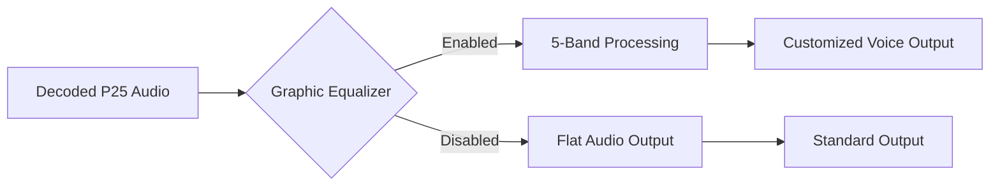

## Goal
Enhance and customize the audio quality of decoded P25 Phase 1 and Phase 2 digital transmissions.

## What are P25 Audio Enhancements?

SDRTrunk includes specialized tuning and filtering options specifically designed for P25 digital audio. This includes a 5-Band Graphic Equalizer, allowing users to fine-tune the frequency response of decoded digital voice to suit their preferences or listening environment.

## Component Map: P25 Audio Controls

*   **Enable Graphic Equalizer Toggle**: Activates the 5-band graphic EQ for the selected P25 channel.
*   **EQ Bands**: Five individual sliders allowing you to boost or cut specific frequency ranges.
    *   *Low frequencies*: Adjust to add warmth or reduce muddiness.
    *   *Mid frequencies*: Crucial for voice intelligibility and presence.
    *   *High frequencies*: Adjust for crispness or to reduce harshness.

## Quick Start

1. Open the **Playlist Editor**.
2. Select a **P25 Phase 1** or **P25 Phase 2** Channel.
3. Scroll down to the **Graphic EQ** configuration pane.
4. Toggle **Enable Graphic Equalizer** to `On`.
5. Adjust the five band sliders while listening to P25 transmissions to achieve the desired audio profile.
