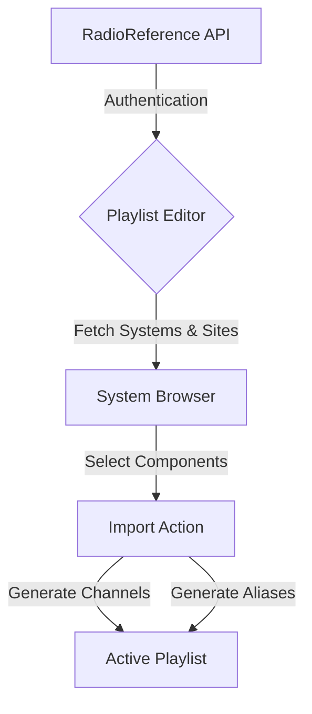

# Import systems with RadioReference

> Configure SDRTrunk Kennebec to connect to the RadioReference API and automatically import radio systems, sites, and talkgroups directly into your playlist.

The RadioReference API integration saves you from manually entering hundreds of talkgroups and frequencies. By authenticating with a RadioReference.com Premium account, you can browse systems by state and county, and pull down system configurations and aliases in seconds.

## Import Flow



## Quick Start: Importing a System

### 1. Open the Radio Reference panel
In the Playlist Editor, click **Radio Reference** in the left sidebar.

### 2. Authenticate your account
Enter your RadioReference.com username and password in the credentials section and click **Login**.
> **Note:**
  A RadioReference.com Premium subscription is required to use the API import feature. Free accounts cannot access the API.

### 3. Browse for your system
Once logged in, use the cascading dropdown menus to locate the system you want to import:
1. Select your **Country**.
2. Select your **State/Province**.
3. Select your **County**.
4. Select the specific **System** you wish to monitor.

### 4. Select components and import
Check the boxes next to the sites and talkgroup categories you want to include. Click **Import**. SDRTrunk Kennebec will automatically create the necessary channels and alias lists in your active playlist.

---

## Radio Reference Editor Interface

When you open the Radio Reference tab, the interface is split into functional zones.

```text
+-------------------------------------------------------------+
| Credentials                  [ Username ] [ Password ] [Login]|
+-------------------------------------------------------------+
| Location & System Selection                                   |
| Country: [ United States v ]   State: [ California v ]        |
| County:  [ Los Angeles v ]     System: [ LAPD Dispatch v ]    |
+-------------------------------------------------------------+
| System Details & Import Options                               |
|                                                               |
| [x] Site 1 (North)             [x] Law Enforcement            |
| [ ] Site 2 (South)             [x] Fire / EMS                 |
|                                [ ] Public Works               |
|                                                               |
|                           [ Import Selected ]                 |
+-------------------------------------------------------------+
```

## Advanced Configuration: Post-Import Tweaks

After the import completes, the generated components behave exactly like manually created ones. You may want to review and adjust them:

### Verify Channel Settings
Navigate to the **Channels** tab in the Playlist Editor. You will see new channels created for the imported system sites.
* Check the **Decoder** protocol (e.g., P25 Phase 1 or Phase 2) to ensure it matches your expectations.
* You may want to manually toggle **Auto-Start** on for your primary control channels so they begin decoding automatically when the application launches.

### Customize Alias Groups
Navigate to the **Aliases** tab. The import process groups talkgroups based on the categories provided by RadioReference (e.g., "Law Enforcement" or "Fire").
* You can assign colors to specific aliases to make them stand out in the Now Playing panel.
* You can add automated actions, such as playing a notification beep or triggering a script, for high-priority talkgroups.
