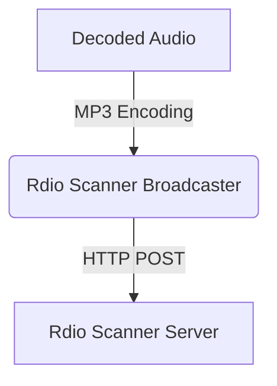

# Stream decoded radio audio to Rdio Scanner

> Configure SDRTrunk Kennebec to broadcast decoded radio audio to an Rdio Scanner server in real time.

SDRTrunk Kennebec can push decoded radio audio directly to an Rdio Scanner server using its API. This integration allows you to ingest audio calls seamlessly into your Rdio Scanner platform for web or app based playback.

## Audio Flow

## Adding an Rdio Scanner broadcaster

1. In SDRTrunk Kennebec, go to **View** > **Streaming**.
2. Click the **+** (Add) button.
3. Select **Rdio Scanner**.

## Configuration Fields

Fill in the required fields in the configuration panel:

| Field | Description |
| --- | --- |
| **Format** | Currently defaults to MP3. |
| **Enabled** | Check this box to enable the streaming output. |
| **Name** | A label for this configuration, e.g. "My Rdio Scanner Stream". |
| **API Key** | Your Rdio Scanner API key for authentication. |
| **System ID** | The numerical ID of the system in Rdio Scanner you are streaming to. |
| **RdioScanner URL** | The base URL of your Rdio Scanner server (e.g. `http://rdio.myorg.com`). Note: `/api/call-upload` is automatically appended. |
| **Max Recording Age (seconds)** | The maximum age (in seconds) of a recording that will be uploaded. |

## Enable and Save

Once configured:
1. Ensure the **Enabled** switch is checked.
2. Click **Save** to apply your changes.

SDRTrunk Kennebec will now upload recorded calls matching your alias configurations to the configured Rdio Scanner instance.
