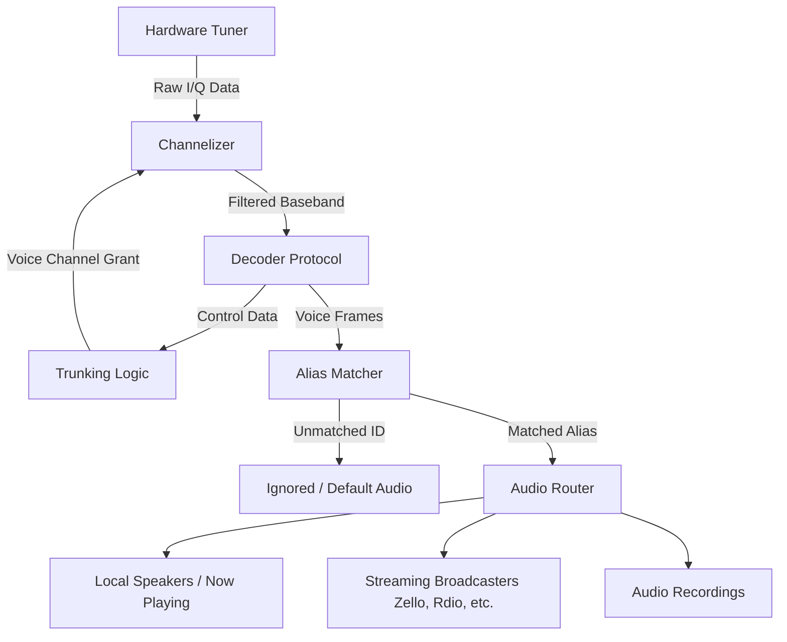

# Signal Flow & Routing

Understanding how a raw radio frequency becomes clear audio is essential for getting the most out of SDRTrunk Kennebec. The application follows a strict pipeline: tuning a hardware device to a frequency, extracting logic and audio, identifying the participants, and finally routing the audio to speakers or streaming destinations.

### Goal

Learn the end-to-end path of a radio transmission as it flows through SDRTrunk Kennebec's processing stages, from the antenna to your ears.

---

## Visual Flow: The Signal Pipeline

---

## Step-by-Step Breakdown

### 1. Hardware Tuner to Channelizer
When SDRTrunk Kennebec starts, it commands your **Hardware Tuner** (like an RTL-SDR or Airspy) to capture a wide chunk of the radio spectrum. This raw spectrum data is sent to the **Channelizer**.
*   **What you see:** The wideband spectrum in the Waterfall display.
*   **Action:** The Channelizer isolates the specific narrow frequencies defined by your configured **Channels**.

### 2. Channelizer to Decoder
The isolated narrowband signal is passed to the **Decoder Protocol** (such as P25, DMR, or Analog).
*   **Action:** The Decoder interprets the raw radio waves, translating them into digital bits (for digital systems) or demodulated audio (for analog systems).

### 3. Logic & Identity (Trunking & Aliasing)
This is where the magic happens for complex systems:
*   **Trunking Logic:** If the decoder is listening to a trunked control channel, it reads the **Control Data** to learn about active voice calls. It automatically commands the Channelizer to tune to the temporary voice frequencies.
*   **Alias Matcher:** As voice frames arrive, the Decoder reads the source Radio ID and destination Talkgroup ID. It checks these IDs against your configured **Aliases**.
    *   *Tip:* If you haven't set up aliases, the system just sees numbers.

### 4. Audio Routing & Destinations
Once a voice call is decoded and identified by an Alias, the **Audio Router** takes over. Based on your settings, it sends the audio to one or more destinations simultaneously:
*   **Local Speakers:** The audio plays through your PC speakers and appears in the **Now Playing** panel.
*   **Streaming Broadcasters:** The audio is encoded (e.g., Opus for Zello, MP3 for Icecast) and sent to your configured streaming endpoints.
*   **Audio Recordings:** An MP3 file is saved to your computer.

---

## Advanced Routing Rules

By default, SDRTrunk Kennebec tries to play everything it decodes. However, you can control the flow using Aliases and Streaming configurations.

*   **Muting:** You can assign an Alias to be muted. The audio will still be decoded (and can still be recorded or streamed), but it won't play out of your local speakers.
*   **Targeted Streaming:** Broadcasters can be configured to only stream audio that matches specific Aliases or Alias Lists. This allows you to run multiple streams (e.g., "Fire Dispatch" and "Police Dispatch") from the same SDRTrunk instance, simply by routing different Aliases to different Zello channels or OpenMHz systems.
*   **Ignoring:** Use the "Ignore Unwanted Talkgroups" feature to stop the audio router entirely for unknown IDs, saving processing power and bandwidth.
