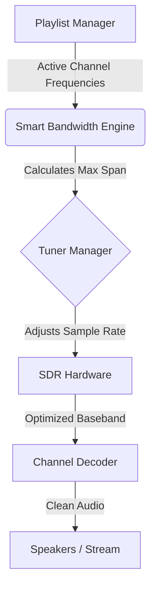

# Smart Bandwidth

> Let SDRTrunk Kennebec automatically optimize your antenna's sample rate so you never miss a call while saving CPU power!

When you set up an SDR (your USB antenna), you usually have to specify how "wide" of a radio view it needs to capture. This is called the "sample rate" or "bandwidth." If you guess too small, you'll miss calls outside your view. If you guess too big, your computer will process useless noise, which can cause slow-downs or crashes.

**Smart Bandwidth** removes the guessing game. It acts as an "autofocus" for your SDR tuner, dynamically adjusting the captured bandwidth to perfectly encompass the active channels in your playlist.

## How it works

Smart Bandwidth continuously analyzes the frequencies of your active channels and communicates with the Tuner Manager to adjust the SDR hardware's sample rate on the fly.

### Signal Flow Logic

## The Benefits

* **Less Computer Strain:** By only capturing exactly what is needed, your computer doesn't have to process empty spectrum, keeping things fast and cool.
* **Zero Math:** You don't have to calculate center frequencies or sample rates. Just add your channels and Kennebec handles the math behind the scenes.
* **Increased Reliability:** Optimized bandwidth means fewer buffer overruns and clearer audio.

> **Tip:**
> Smart Bandwidth is an automatic, behind-the-scenes optimization engine. It is enabled automatically for most supported tuners (like RTL-SDR and Airspy) out of the box!
