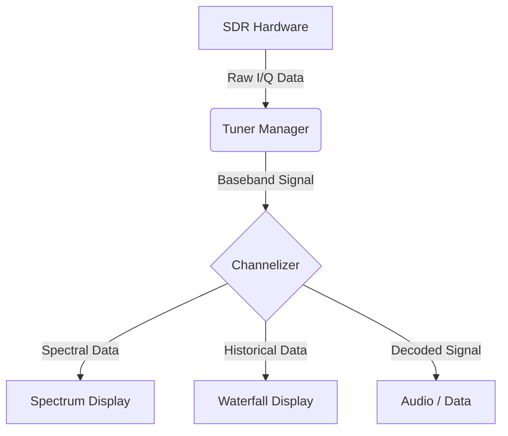

# Spectrum & Waterfall Display

The **Spectrum & Waterfall** display in SDRTrunk provides a real-time visual representation of the radio frequency (RF) spectrum. It is an essential tool for identifying active signals, diagnosing interference, and understanding the RF environment around your tuned frequencies.

## Visual Overview

The spectral display consists of two main components that are vertically stacked:

 

| Component | Description |
|---|---|
| **Spectrum (Top)** | A real-time graph showing signal amplitude (power) on the vertical axis and frequency on the horizontal axis. Active signals appear as peaks. |
| **Waterfall (Bottom)** | A scrolling historical view. Frequency is on the horizontal axis, time flows downwards, and color intensity represents signal strength (blue/black for noise, yellow/red for strong signals). |

 

### Signal Flow Logic

## Navigating the Display

You can interact directly with the Spectrum & Waterfall display to adjust your view and manage active channels.

### Zooming and Panning

- **Scroll Wheel**: Hover your mouse over the display and use the scroll wheel to zoom in (scroll up) and zoom out (scroll down) centered on your cursor.
- **Click and Drag**: Click and hold the left mouse button, then drag left or right to pan across the frequency spectrum.

### Interacting with Channels

Active channels currently being decoded are overlaid on the spectrum display as highlighted bands.

- **Double-Click**: Double-clicking within an active channel band opens its configuration in the **Playlist Editor**.
- **Right-Click**: Right-clicking on an active channel band opens a context menu.

## Context Menu Actions

Right-clicking anywhere on the Spectrum & Waterfall display opens a context menu with several options:

| Action | Description |
|---|---|
| **Mute/Unmute** | Quickly mute or unmute the audio output for a specific active channel directly from the spectral waterfall display. |
| **Center Frequency** | Sets the tuner's center frequency to the clicked location. |
| **Zoom Reset** | Resets the zoom level to show the full bandwidth of the tuner. |
| **Disable Spectrum/Waterfall** | Disables the spectral display to reduce CPU usage. |
| **FFT Width** | Allows you to select the Fast Fourier Transform (FFT) bin size. Higher sizes offer better frequency resolution but use more CPU. |

> **Tip**
>
  If you are running SDRTrunk on a lower-end machine, disabling the Spectrum & Waterfall display can significantly reduce CPU load and improve decoding performance.

## Mute/Unmute from Waterfall

A key efficiency feature is the ability to quickly manage audio without opening the channel configuration. By right-clicking an active signal band in the waterfall, you can immediately toggle its **Mute** state.

1. Locate the active channel band you wish to silence.
2. Right-click directly on the colored band in the waterfall or spectrum view.
3. Select **Mute** to silence the audio, or **Unmute** to restore it.

This is especially useful when monitoring multiple active frequencies and you need to temporarily silence a disruptive or uninteresting conversation.
