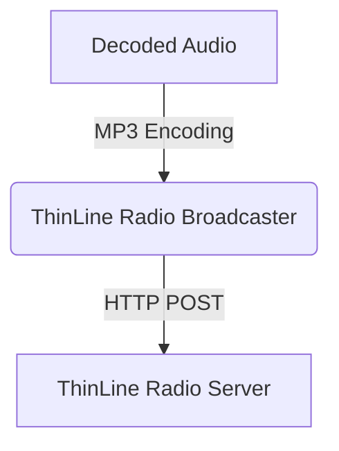

# Stream decoded radio audio to ThinLine Radio

> Configure SDRTrunk Kennebec to broadcast decoded radio audio to a ThinLine Radio server in real time.

SDRTrunk Kennebec can push decoded radio audio directly to a ThinLine Radio server using its API. This integration allows you to ingest audio calls seamlessly into your ThinLine Radio platform.

## Audio Flow

## Adding a ThinLine Radio broadcaster

1. In SDRTrunk Kennebec, go to **View** > **Streaming**.
2. Click the **+** (Add) button.
3. Select **ThinLine Radio**.

## Configuration Fields

Fill in the required fields in the configuration panel:

| Field | Description |
| --- | --- |
| **Format** | Currently defaults to MP3. |
| **Name** | A label for this configuration, e.g. "My ThinLine Stream". |
| **API Key** | Your ThinLine Radio API key for authentication. |
| **System ID** | The numerical ID of the system in ThinLine Radio you are streaming to. |
| **ThinLine Radio URL** | The base URL of your ThinLine Radio server (e.g. `http://thinline.myorg.com`). Note: `/api/call-upload` is automatically appended. |
| **Max Recording Age** | The maximum age (in seconds) of a recording that will be uploaded. |

## Enable and Save

Once configured:
1. Toggle the **Enabled** switch to turn on the stream.
2. Click **Save** to apply your changes.

SDRTrunk Kennebec will now upload recorded calls matching your alias configurations to the configured ThinLine Radio instance.
