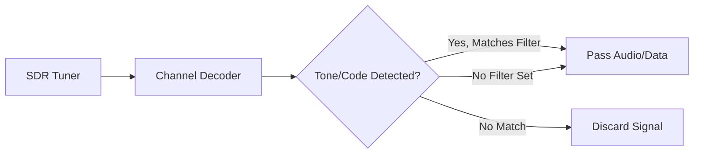

# Tone & Code Filtering

SDRTrunk allows you to filter unwanted signals and interference by decoding and matching specific sub-audible tones (CTCSS/DCS) on analog channels or Network Access Codes (NAC) on digital P25 channels.

## Goal
Configure SDRTrunk to open squelch and process audio *only* when the received signal contains a specified tone or code, allowing you to reject interference or monitor specific agencies on shared frequencies.

## Visual Flow: Filtering Logic

## Quick Start: Adding a CTCSS / DCS Filter

For analog NBFM channels, follow these steps:

1. Navigate to the **Channels** tab and select the desired NBFM channel.
2. In the Channel Editor panel, scroll down to the **Squelch / Tones** section.
3. Click **Add Tone Filter**.
4. Set the Type to **CTCSS** (Continuous Tone-Coded Squelch System) or **DCS** (Digital Coded Squelch).
5. Select the specific Tone Frequency or Code from the dropdown (e.g., `100.0 Hz` or `023`).
6. Click **Save**.

<Tip>
You can add multiple CTCSS/DCS entries to a single channel. SDRTrunk will pass audio if **any** of the configured tones are detected.
</Tip>

## Quick Start: Adding a P25 NAC Filter

For digital P25 Phase 1 or Phase 2 systems:

1. Navigate to the **Channels** tab and select your P25 channel.
2. In the Channel Editor panel, find the **NAC Filter** section.
3. Enable the **NAC Filter** toggle.
4. Enter the 12-bit hexadecimal NAC value (e.g., `293`).
5. Click **Save**.

Messages not matching the configured NAC will be ignored, preventing cross-talk from adjacent systems on the same frequency.

## Advanced Configuration

### P25 NAC Override
If you need to strictly enforce a specific NAC while also translating it for external systems, you can use the **P25 NAC Override** feature. This allows you to rewrite the decoded NAC before it is passed to the alias mapping and recording system.

### Mixing Squelch Types
On analog channels, you can mix both CTCSS and DCS tone filters. SDRTrunk treats them as an "OR" condition: if any single configured code is detected, the audio is processed.
