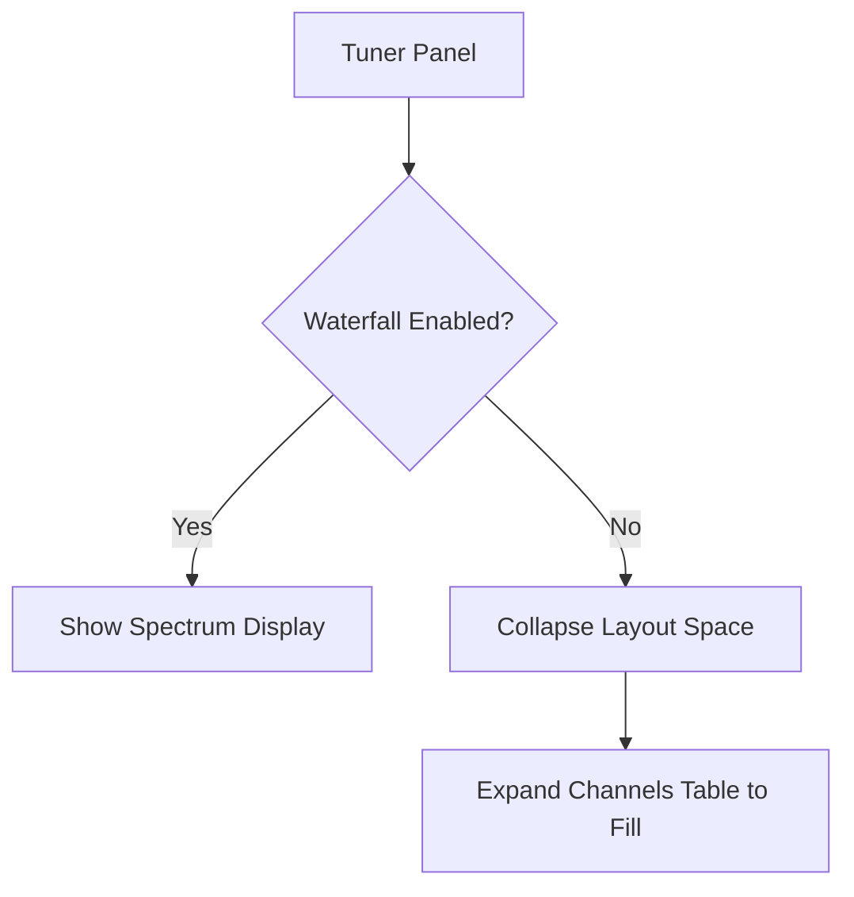

# Tuner Waterfall Collapse

## Goal

The **Tuner Waterfall Collapse** feature optimizes your screen real estate by completely hiding the spectrum waterfall when it is disabled, allowing your channel lists to expand and fill the freed space.

## Zero-Height Collapse

In previous versions, disabling the waterfall display left a blank placeholder in the UI. SDRTrunk Kennebec introduces a zero-height collapse model.

## Step-by-Step

When you disable the waterfall:
1. The spectral components (`height = 0`, `visible = false`, `managed = false`) are completely removed from the layout hierarchy.
2. The bottom channels table automatically scales upwards to ingest the remaining vertical viewport space.

### Workflow Benefit

If you run SDRTrunk on a lower-resolution monitor or a laptop, this feature guarantees maximum visibility for your active decoding operations.
