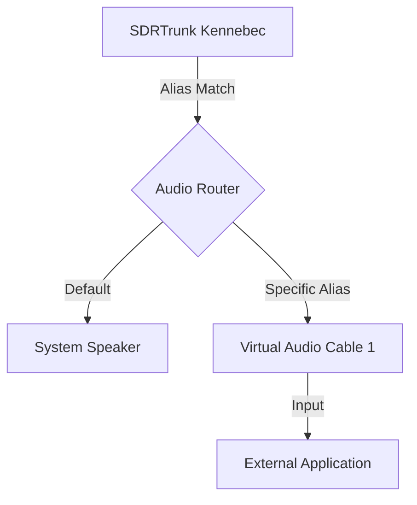

# Route audio to external applications with Virtual Audio Cables

## Goal
> Configure SDRTrunk Kennebec to route decoded radio audio directly to Virtual Audio Cable (VAC) outputs for integration with external applications like TwoToneDetect, streaming encoders, or recording software.

SDRTrunk Kennebec can isolate audio from specific talkgroups or radio IDs and route it directly to designated audio output devices, bypassing the primary application speaker. By installing third-party Virtual Audio Cable (VAC) software on your system, you can use this feature to pass pristine, decoded audio directly into other programs running on the same computer.

## Audio Routing Flow

## Supported VAC Software
SDRTrunk Kennebec interacts with virtual audio cables just like standard physical speakers. You will need to install a third-party VAC driver on your operating system. Common solutions include:
* **Windows:** VB-Audio Virtual Cable (VB-Cable) or Virtual Audio Cable (VAC)
* **macOS:** BlackHole or Loopback
* **Linux:** PulseAudio Null Sinks or PipeWire Virtual Devices

## Assigning a VAC to an Alias

Audio routing in SDRTrunk Kennebec is configured at the alias level. When a decoded call matches an alias, the audio is sent to the specific output device assigned to that alias.

### Step 1: Open the Alias Editor
In the Playlist Editor, click **Aliases** in the sidebar.

### Step 2: Select the Target Alias
Find and select the alias you want to route (e.g., "Fire Dispatch" or a specific pager tone).

### Step 3: Configure the Audio Output Device
In the alias detail editor panel below the table, locate the **Audio output device** property. Click the dropdown menu and select the virtual audio cable you installed (e.g., `CABLE Input (VB-Audio Virtual Cable)`).

### Step 4: Save the Alias
Click **Save**. Any future calls matching this alias will now be routed exclusively to the selected Virtual Audio Cable.

> **Note:**
  When a specific audio output device is assigned to an alias, the audio for that alias will **no longer play** through your default computer speakers. It is routed entirely to the VAC.

## Advanced: Routing Multiple Aliases
You can assign the same Virtual Audio Cable to multiple aliases if you want an external application to listen to several talkgroups at once.

Conversely, if you have multiple virtual audio cables installed (e.g., VB-Cable A and VB-Cable B), you can route different aliases to different applications simultaneously. For instance, route "Fire Dispatch" to VB-Cable A for a paging app, and "Police Dispatch" to VB-Cable B for a dedicated recorder.

## Verifying the Output
If your external application is not receiving audio:
1. Verify the alias is correctly matching the active calls (the alias name should appear in the Now Playing panel).
2. Ensure the external application is configured to listen to the *Output* or *Microphone* side of the Virtual Audio Cable you selected.
3. Check your operating system's sound mixer to ensure the volume for the virtual cable is not muted.
