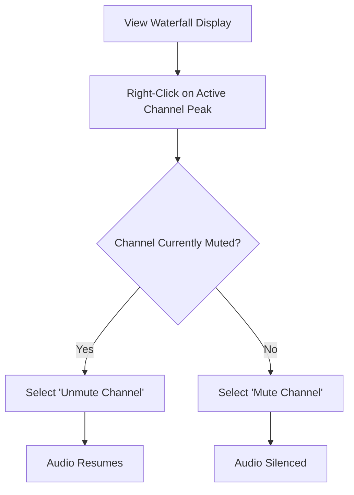

## Goal
Quickly mute or unmute active radio channels directly from the spectral waterfall display without navigating menus.

# Waterfall Audio Controls

SDRTrunk Kennebec adds new quality-of-life shortcuts directly to the spectrum and waterfall view, allowing operators to silence active channels instantly.

## Mute/Unmute Flow

## Quick Start

1. Navigate to the **Now Playing** or **Waterfall** tab.
2. Locate a highlighted peak indicating an active transmission.
3. Right-click directly on the peak.
4. Select **Mute** or **Unmute** from the context menu.

> **Warning:**
> Muting a channel from the waterfall acts as a temporary override. Restarting SDRTrunk will revert the channel to its default playback state.

## Advanced Configuration

You can configure exactly what happens when you mute a channel from the waterfall. In the main preferences under "Audio Routing", you can specify whether muting only silences local speaker playback or if it also temporarily pauses remote streaming destinations like Zello.

## UI Component Map

| Component | Function |
| --- | --- |
| **Waterfall Peak Indicator** | Represents an active radio transmission. |
| **Right-Click Context Menu** | Provides quick actions for the specific channel frequency clicked. |
| **Mute/Unmute Toggle** | Temporarily overrides the channel's audio state. |

## Related Topics
* [Spectrum & Waterfall](spectrum-&-waterfall.md)
