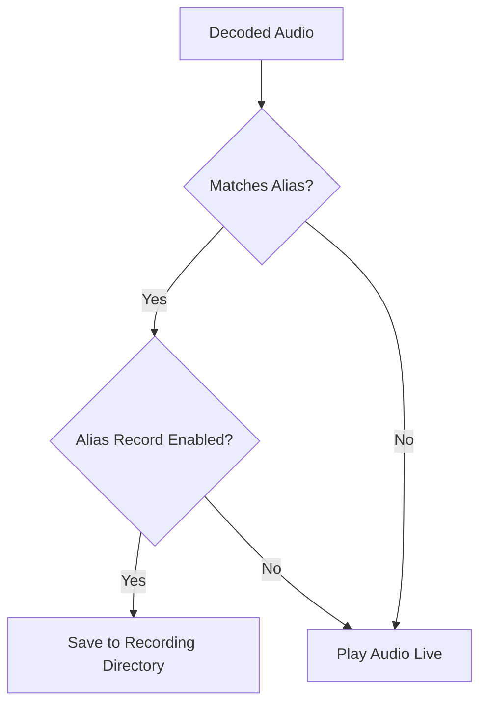

# Audio Recordings

## Goal
Learn how to record decoded radio traffic, and use the Audio Recordings panel to browse, filter, and play back your audio files.

## Recording Logic Flow

## Component Map

* **Filters:** Tools to narrow down recordings by Date Range, Time Range, Alias, and Channel.
* **Recordings Table:** A sortable list of all recorded audio files matching your filters.
* **Play Button:** Found in the Action column; plays the selected recording immediately within the application.

## Step-by-Step Configuration

1. **Enable Recording on an Alias:**
   * Open the **Playlist Editor** and go to **Aliases**.
   * Select the alias you wish to record.
   * Click **Add ID**, choose **Record**, and hit **Save**.

> **Tip:** You can assign multiple recording aliases to the same frequency to sort calls by different criteria.

2. **Set the Recordings Directory:**
   * Open **User Preferences** -> **File Storage** -> **Directories**.
   * Define the path where audio files should be saved.

> **Note:** Make sure the system has adequate write permissions and disk space for the target directory.

3. **View and Play Back:**
   * Open **View -> Audio Recordings**.
   * Use the filters to find the recorded call.
   * Click the **Play** button in the Action column.
