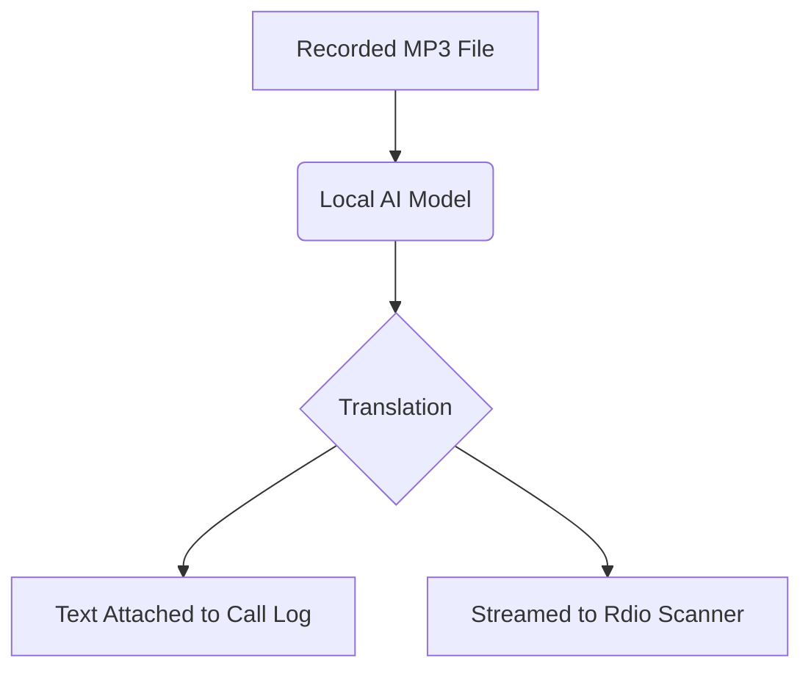

# Audio Transcriptions

## Goal
Turn radio talk into text automatically so you can search and read through your dispatch logs without listening to hours of audio.

## The Transcription Process

## Setup Process

1. Open **User Preferences**.
2. Navigate to the **AI & Processing** tab.
3. Check the box for **Enable Audio Transcriptions**.

> **Note:**
> The transcription happens securely right on your computer. Your audio is not sent to random cloud servers.

## Advanced Configuration

While the default setup works well, advanced users may wish to configure custom models. See [Diagnostics](diagnostics.md) to debug any setup issues.

## Interface Component Map

* **Enable Audio Transcriptions:** Turns the AI transcription engine on or off globally.
* **AI Model Selection:** Allows choosing between Whisper and Google Speech-to-Text models based on speed or accuracy preferences.
* **Log Integration Toggle:** Specifies if the transcribed text should be attached directly into the main Calls list.
