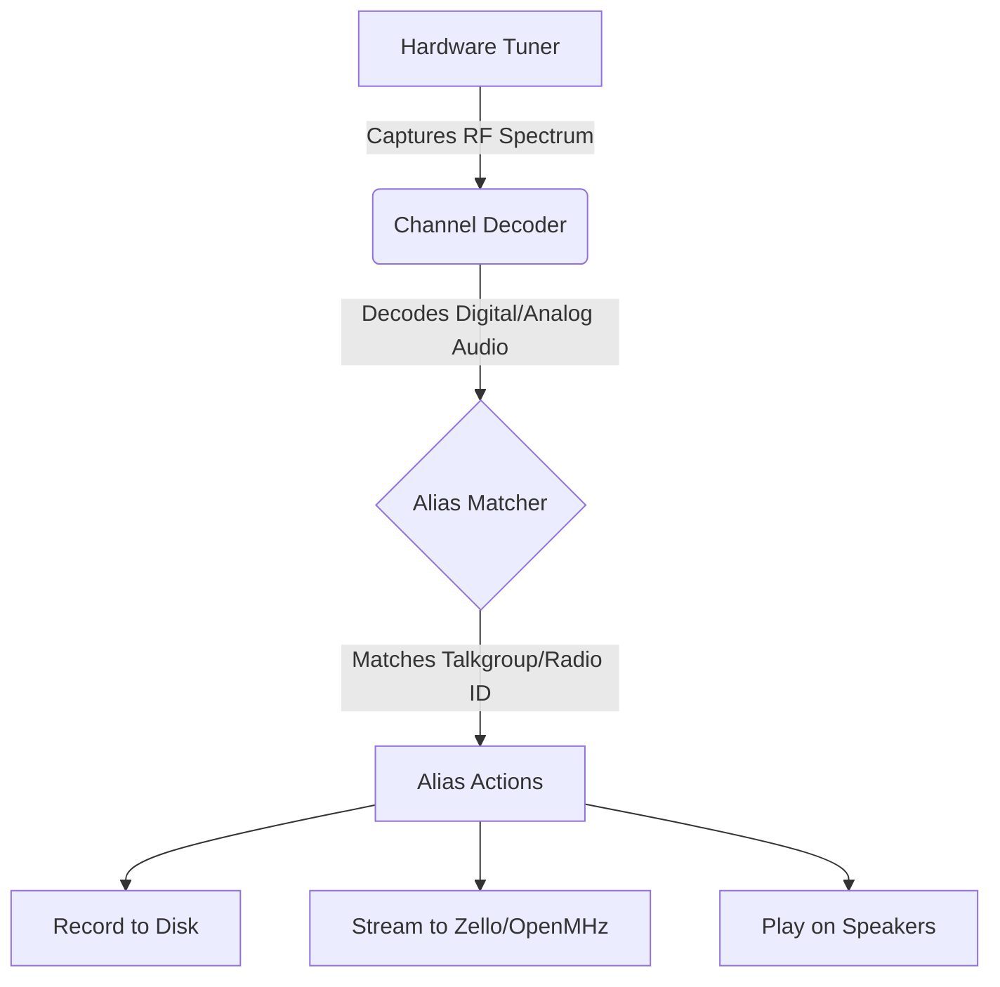

# Call Flow Logic

## Goal
Understand the core processing flow of SDRTrunk Kennebec: how a radio signal is captured by your antenna and eventually turned into streaming audio or a recorded file.

SDRTrunk Kennebec processes radio traffic in a linear pipeline. Understanding this pipeline is crucial for troubleshooting why a specific talkgroup might not be streaming or recording.

## The Signal Pipeline

## Step-by-Step Breakdown

1. **Hardware Tuner (The Ear):** Your RTL-SDR or HackRF captures the raw radio frequency (RF) spectrum from the airwaves.
2. **Channel Decoder (The Brain):** The software tunes to a specific frequency within that spectrum and decodes the digital data (like P25 or DMR) into raw audio and metadata.
3. **Alias Matcher (The Filter):** The decoded metadata (e.g., Talkgroup 101) is compared against your configured Alias Lists.
4. **Alias Actions (The Output):** If a match is found, SDRTrunk executes the actions assigned to that Alias. This could involve playing the audio through your speakers, recording it to an MP3 file, or pushing it to a streaming platform.

> **Tip:**
> If you hear audio but it isn't streaming, check your **Alias** configuration. The stream must be explicitly linked to the Alias as an action!
