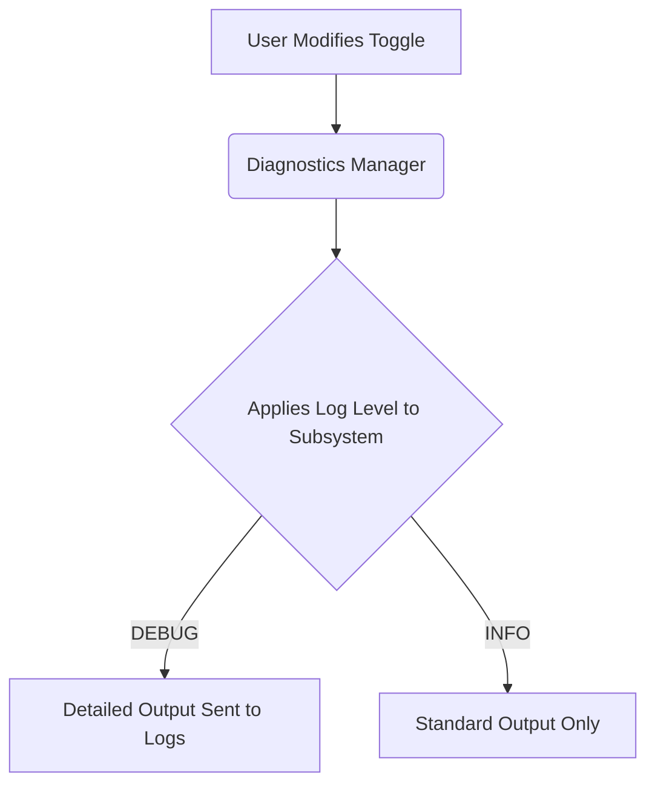

# Enable Diagnostics and Debug Logging in SDRTrunk

## Goal
Enable detailed diagnostic logs for specific subsystems of SDRTrunk in real-time to troubleshoot streaming, tuning, or decoding issues without needing an app restart.

## Logging Workflow

## Step-by-Step Guide

1. Open **View -> User Preferences**.
2. Click **Diagnostics (Logging)** under the Application header.
3. Check the box next to the subsystem you are actively troubleshooting (e.g., Zello streaming).
4. Go to **View -> Logs** to watch the real-time debug output.

> **Tip:**
> Disable the diagnostics categories when you are finished testing, as leaving them on for high-volume subsystems (like P25 decoder) can quickly consume disk space!

## Advanced Configuration

For advanced troubleshooting, you can combine this with GPU debugging if you are using [GPU Acceleration](gpu-acceleration.md).

## Component Map

* **Enable ALL diagnostics categories:** Master switch that instantly turns on debug logging across every single system component.
* **Zello streaming:** Captures WebSocket connections, Opus encoder state, and reconnection attempts.
* **ThinLine Radio streaming:** Captures upload requests, HTTP responses, and retry attempts.
* **P25 decoder:** Outputs deep-level protocol messages, NAC filtering events, and control channel data.
* **RTL-SDR tuners:** Logs USB transfers, gain settings, and frequency correction events.
