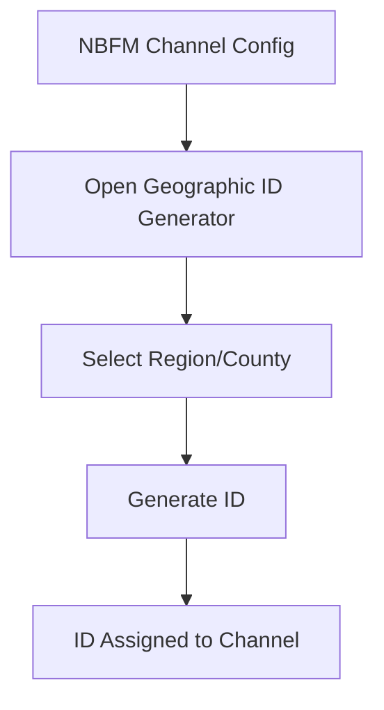

## Goal
The **Geographic ID Generator** helps you quickly generate standard talkgroup IDs for NBFM channels based on county or region selections.

# Geographic ID Generator

When setting up new NBFM channels, it can be tedious to manually assign talkgroup IDs that match your local geographic structure. The Geographic ID Generator automates this process.

## Step-by-Step

1. Open the **Playlist Editor**.
2. Select or create an **Analog (NBFM)** channel.
3. Locate the **Geographic ID Generator** tool in the channel configuration panel.
4. Select your desired region or county from the dropdown menus.
5. Click **Generate** to automatically assign the correct talkgroup ID.

### Workflow Benefit

## Component Map

* **Region/County Dropdowns:** Select the geographic area for the channel.
* **Generate Button:** Calculates and applies the talkgroup ID based on the selection.
