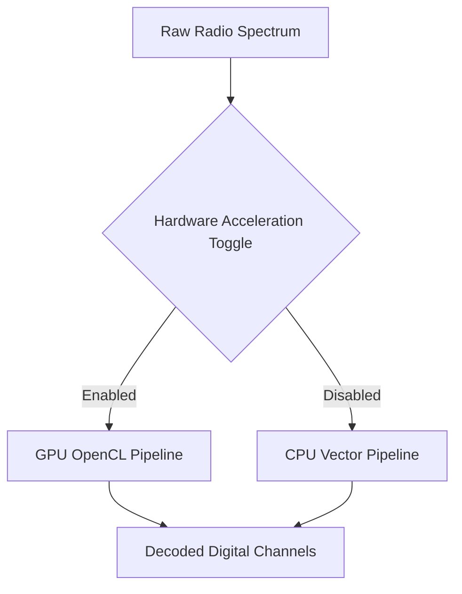

# GPU Acceleration (Aparapi OpenCL)

## Goal
Offload complex signal processing tasks to the Graphics Processing Unit (GPU) to lower CPU usage and allow decoding of more concurrent radio channels.

## Processing Flow

## How to Enable

1. Open SDRTrunk Kennebec and navigate to the **User Preferences** menu.
2. Select the **Advanced** tab.
3. Locate the **Hardware Acceleration (OpenCL)** section.
4. Check the box to **Enable GPU FFT Processing**.
5. Restart the application.

> **Warning:**
> Ensure your graphics drivers are fully up to date. If the app crashes on startup after enabling this, set `gpu_acceleration_enabled=false` in your `SDRTrunk.properties` file.

## Advanced Configuration

If you experience crashes, you may need to disable hardware acceleration manually via config files. See [System Requirements](system-requirements.md) for supported cards.

## Component Map

* **Enable GPU FFT Processing:** Moves Heavy Fast Fourier Transform calculations from the CPU to the graphics card.
* **OpenCL Device Selector:** Lets you pick which physical GPU to use if you have multiple graphics cards installed.
